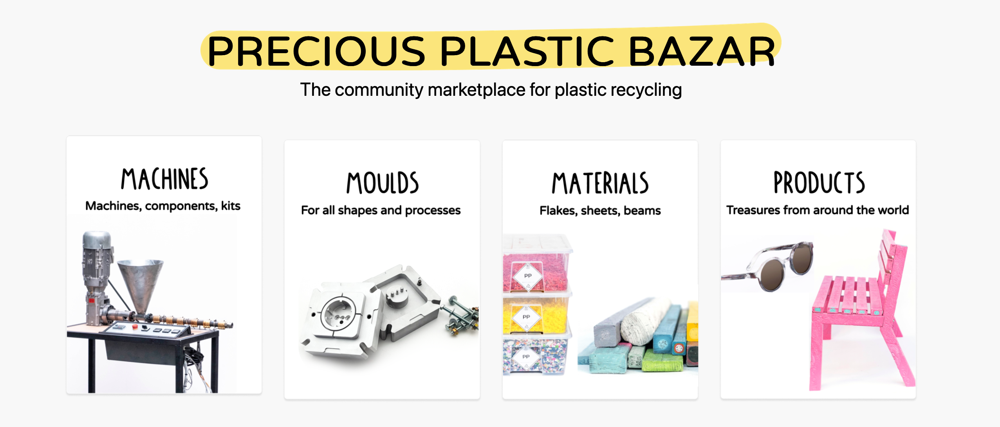
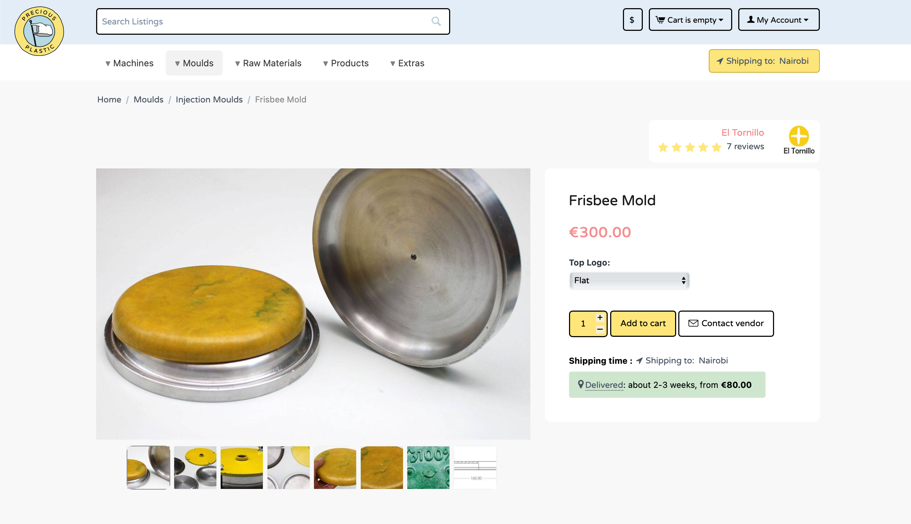

 

# プレシャス・プラスチック・バザールで売買する 

[プレシャス・プラスチック・バザール](http://bazar.preciousplastic.com/)**は、プレシャス・プラスチックの機械、金型、原材料、製品の売り手と買い手をつなぐピアツーピア・マーケットプレイスです。掲載されているものはすべて、世界中のプレシャスプラスチックのワークスペースによって作られたものです。他のワークスペースとつながり、あなたのワークスペースを始めたり改善したりするために必要なアイテムを見つけるための素晴らしいツールです👊。 

## バザールで買いたい？ 
 
バザールは、ワールドワイドウェブにある他のeコマースプラットフォームと同じように機能します。手順は以下の通りです： 
1.リストを検索するか、またはカテゴリ別に閲覧. 
2.世界中の様々な売り手からオファーを見つける（可能であれば地元で買う🌍）。 
3.ショッピングカードに商品を追加する。 
4.チェックアウトし、クレジットカードまたはPaypalで支払う。**支払いは販売者に直接行われるため、PER販売者をチェックアウトする必要があります。 
5.商品を受け取ります。 
6.コミュニティに貢献するため、販売者にレビューを投稿してください。 
> Precious Plasticは、バザーを通じて商品が購入された場合、**5%の取引手数料**を受け取ります。 
## バザーで売りたいですか？ 

ワークスペースが稼働し、**[販売](https://bazar.preciousplastic.com/index.php?dispatch=companies.apply_for_vendor)** をバザーで行いたい場合、始める前に知っておくべきいくつかの条件があります。 
* あなたは、**登録された企業/組織** が必要です（それは支払いプロセッサによって必要とされる）。 
* あなたは、**バザー** で開始された取引を完了することに同意します。あなた自身の支払い方法を使用するために、顧客にプラットフォームから電子メールを送ってもらうことは禁止されています。取引手数料を避けるためにプラットフォームを迂回することは、プラットフォームとPrecious Plasticコミュニティを傷つけることになります。 
* すべての取引問題は**売り手と顧客**の間で解決される必要があります。プレシャスプラスティックは紛争に責任を負いません。

* リスティングを公開する前に、**支払いアカウント**を接続する必要があります。
* [利用規約](https://bazar.preciousplastic.com/terms-and-conditions/)を読み、同意する。 
> アカデミーの[アカウントの設定](https://community.preciousplastic.com/academy/business/Account_Setup)から始めるのがベストです。 
## Enjoy :) 

草の根のリサイクル業者たちを応援し、買い、売り、見て楽しんでください！ 
