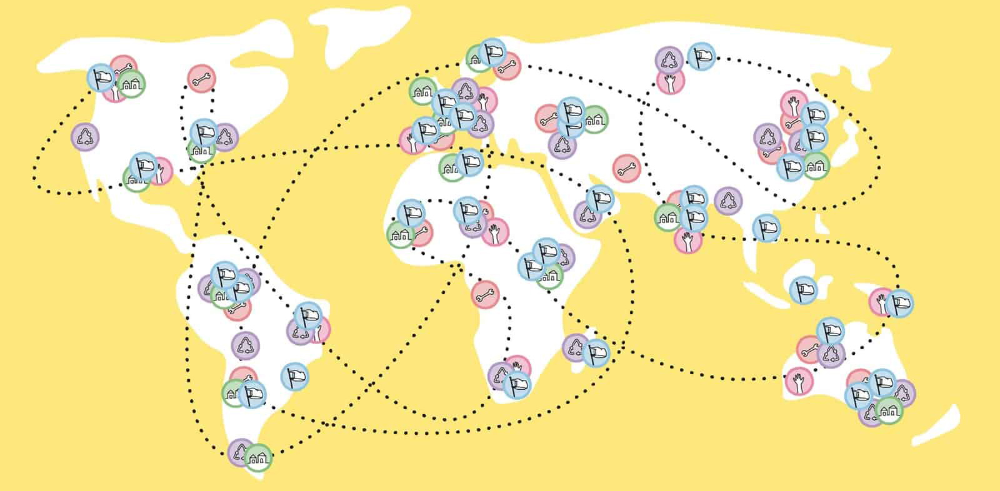
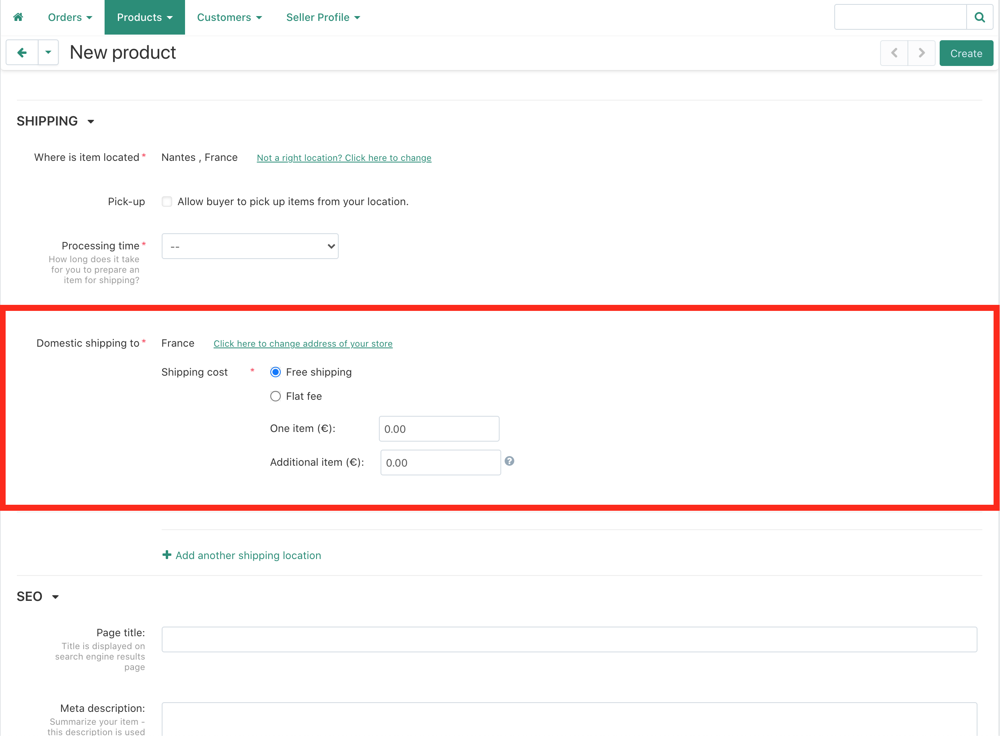
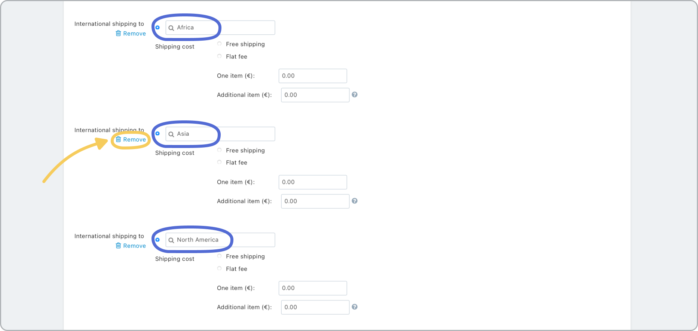
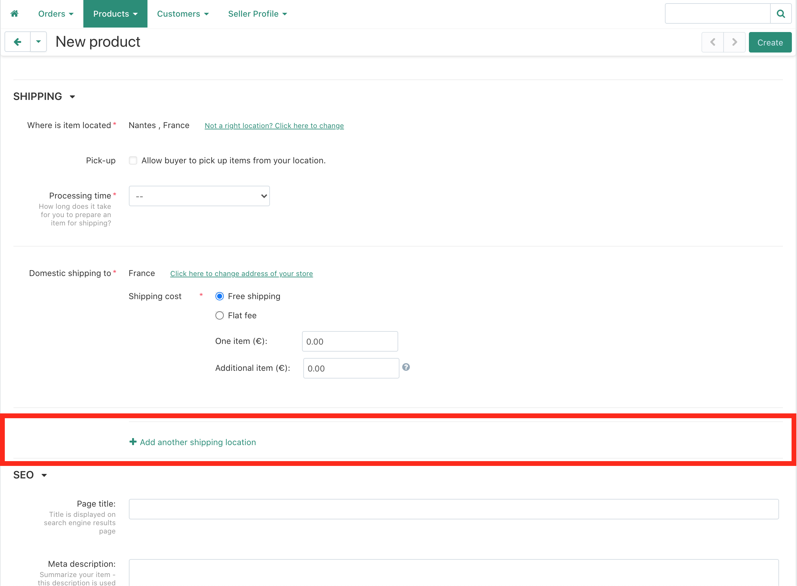
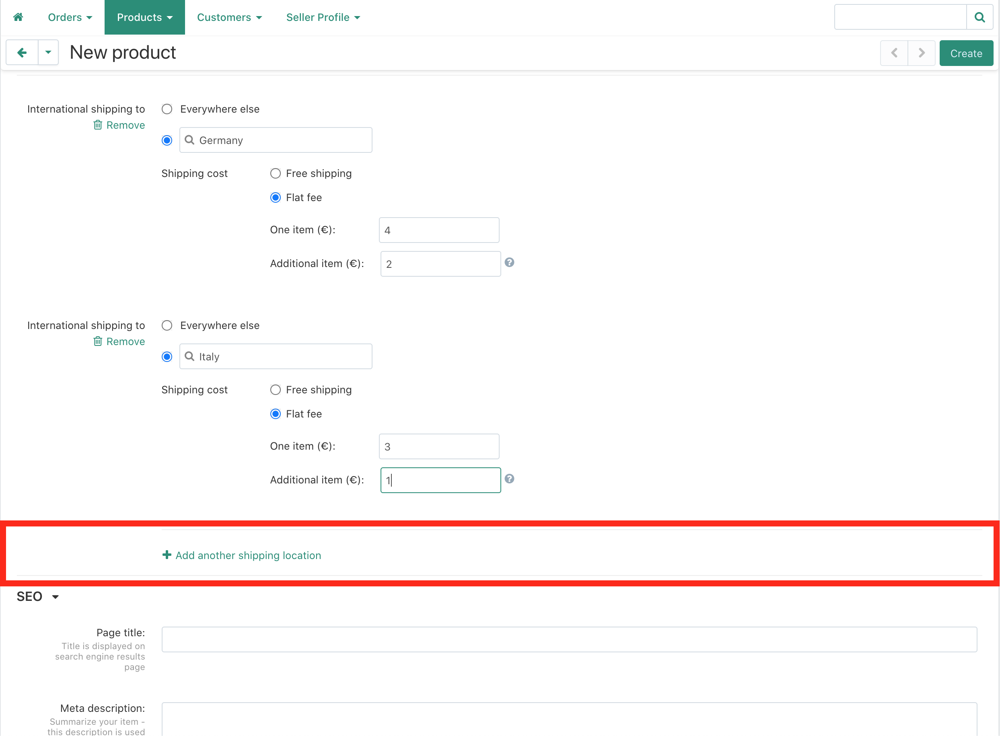
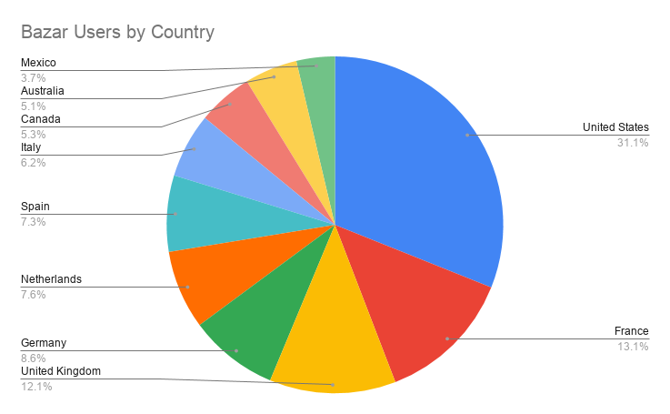

 

# 配送オプションの設定 
世界中のユーザーが毎日バザーを訪れています。出品者としては、配送オプションを適切に設定することが重要であり、そうすることで、あなたの出品物が何の障壁もなく購入できるようになります。 
> 配送オプションを提供しない場合はどうなりますか？彼らはあなたの場所を追加するように要求するためにあなたにメッセージを書くことができますが、多くの顧客は、この余分な手順を実行しないので、**あなたの販売を失う可能性があります**。 
最初にこの設定をすることで、双方にとってよりスムーズな体験となり、バザーでの売上を伸ばす大きな助けとなります。 
## 1.国内発送 
商品には最低限、国内（あなたの国）の送料が必要です。 
送料を設定するには、通常2つのオプションがあります： 
**送料無料：**あなたの製品の標準価格に送料を計算することができますので、余分なコストが適用されません。簡単です。 
* 定額料金:**ここでは、**1つのアイテム**と**追加アイテム**の送料を定義します。製品、金型、シュレッダープラスチックのような小さなアイテムの場合、数量が多くても送料はあまり変わらないかもしれません（そのため、無料、または「1つのアイテム」の価格よりも小さくすることができます）が、追加のマシンの場合は、おそらく追加されたアイテムごとに同じ送料を追加する必要があります。 
 
# # 2. 
また、地域をまたいで送料を適用することもでき、その地域にあるすべての国に適用されます。この方法で、多くの国の送料を素早く設定することができます。 
> しかし、顧客との取引中にややこしいことにならないよう、**事前に**どのような価格や条件で取引しているのかを把握しておくようにしましょう。 
地域はデフォルトで表示されますが、すべての地域に配送を提供したくない場合は、個々の地域を手動で削除することができます（また、必要に応じて後で再度追加することもできます）。 
地域内でも配送料が異なる場合があるので、特定の国に対して異なる配送料を設定することもできます。 
 
## 3.特定の国 
同じ地域内の国への配送料金は比較的似通っていることが多いが、国によって料金が異なることがある。 
顧客に高額な請求をしていないか、送料で損をしていないかを確認するために、特定の国ごとに価格を設定することもできます。 
> より多くの国を設定すればするほど、より正確で公平な送料を設定することができます。その反面、設定や更新に手間がかかります。そのため、地域ごとに設定すると便利です。 
 
### 地域とその中の特定の国に対して異なる送料を設定できますか？ 
はい！地域のほとんどの国に適した価格を設定することができ、その後、価格が大きく異なる特定の国の価格を追加することができます。 
 
### バザール最大の市場を必ず追加してください。 
すべての場所が同じ影響力を持っているわけではありません。Bazarユーザーの多くがいる国もあります。販売の可能性を高めるために、これらの国への配送オプションを追加してください。 
 
## 各地域にはどのような国がありますか？ 
🌍 Region | 🏳 Countries |  Countries . 
--- | --- | --- 
**Europe** | - Albania   - Andorra   - Armenia   - Austria   - Azerbaijan   - Belarus   - Belgium   - Bosnia and Herzegovina   - Bulgaria   - Croatia   - Cyprus   - Czechia   - Denmark   - Estonia   - Finland   - France   - Georgia   - Germany   - Greece   - Hungary   - Iceland   - Ireland   - Italy   - Kazakhstan   - Kosovo   - Latvia  | - Liechtenstein   - Lithuania   - Luxembourg  - Malta   - Moldova   - Monaco   - Montenegro   - Netherlands   - North Macedonia   - Norway   - Poland   - Portugal   - Romania   - Russia   - San Marino   - Serbia   - Slovakia   - Slovenia   - Spain   - Sweden   - Switzerland   - Turkey   - Ukraine   - United Kingdom   - Vatican City (Holy See) 
**North America** | - Antigua and Barbuda   - Bahamas   - Barbados   - Belize   - Canada   - Costa Rica   - Cuba   - Dominica   - Dominican Republic   - El Salvador   - Grenada   - Guatemala   - Haiti   - Honduras   - Jamaica   - Mexico   - Nicaragua   - Panama   - Saint Kitts and Nevis   - Saint Lucia   - Saint Vincent and the Grenadines   - Trinidad and Tobago   - United States of America   | - Anguilla (UK)   - Aruba (Netherlands)   - Bermuda (UK)   - Bonaire (Netherlands)   - British Virgin Islands (UK)   - Cayman Islands (UK)   - Clipperton Island (France)   - Curacao (Netherlands)   - Greenlands (Denmark)   - Guadeloupe (France)   - Martinique (France)   - Montserrat (UK)   - Navassa Island (USA)   - Puerto Rico (USA)   - Saba (Netherlands)   - Saint Barthelemy (France)   - Saint Martin (France)   - Saint Pierre and Miquelon (France)   - Sint Eustatius (Netherlands)   - Sint Maarten (Netherlands)   - Turks and Caicos (UK)   - US Virgin Islands (USA) 
**Oceania** | - Australia   - Fiji   - Kiribati  - Marshall Islands   - Micronesia   - Nauru   - New Zealand   - Palau    - Papua New Guinea   - Samoa   - Solomon Islands   - Tonga   - Tuvalu   - Vanuatu  | - American Samoa (USA)   - Cook Islands (New Zealand)   - French Polynesia (France)   - Guam (USA)   - New Caledonia (France)   - Niue (New Zealand)   - Norfolk Island (Australia)   - Northern Mariana Islands (USA)   - Pitcairn Islands (UK)   - Tokelau (New Zealand)   - Wake Island (USA)   - Wallis and Futuna (France) 
**Africa** | - Algeria   - Angola   - Benin   - Botswana   - Burkina Faso   - Burundi   - Cabo Verde   - Cameroon   - Chad   - Comoros   - Democratic Republic of the Congo   - Republic of the Congo   - Djibouti   - Egypt   - Equatorial Guinea   - Ethiopia   - Gabon   - Gambia   - Ghana   - Guinea   - Guinea-Bissau   - Ivory Coast   - Kenya   - Lesotho   - Liberia   - Libya   | - Madagascar   - Malawi   - Mali   - Mauritania   - Mauritius   - Morocco   - Mozambique   - Namibia   - Niger   - Nigeria   - Rwanda   - Sao Tome and Principe   - Senegal   - Seychelles   - Sierra Leone   - Somalia   - South Africa   - South Sudan   - Sudan   - Tanzania   - Togo   - Tunisia   - Uganda   - Zambia   - Zimbabwe 
**Asia** | - Afghanistan   - Armenia   - Azerbaijan   - Bahrain   - Bangladesh   - Bhutan   - Brunei   - Cambodia   - China   - Cyprus   - Georgia   - India   - Indonesia   - Iran   - Iraq   - Israel   - Japan   - Jordan   - Kazakhstan   - Kuwait   - Kyrgyzstan   - Laos   - Lebanon    - Malaysia   | - Maldives   - Mongolia    - Myanmar (Burma)   - Nepal   - North Korea   - Oman   - Pakistan   - Palestine   - Philippines   - Qatar   - Russia   - Saudi Arabia   - Singapore   - South Korea   - Sri Lanka   - Syria   - Taiwan   - Tajikistan   - Thailand   - Timor-Leste   - Turkey   - Turkmenistan   - United Arab Emirates   - Uzbekistan   - Vietnam   - Yemen 
**South America** | - Argentina   - Bolivia   - Brazil   - Chile   - Colombia   - Ecuador   - Guyana   - Paraguay   | - Peru   - Suriname   - Uruguay   - Venezuela   - Falkland Islands (UK)   - French Guinea (France)   - South Georgia and the South Sandwich Islands (UK) 

## 質問は？ご意見は？ 

また、重要な情報やヒントを見逃したと思われる場合は、遠慮なく直接お問い合わせください。 
Discordの[#🙌bazar-sellerチャンネル](https://discord.gg/2E93VxB3CD)、または**bazar@preciousplastic.com**までメールをお送りください。 
