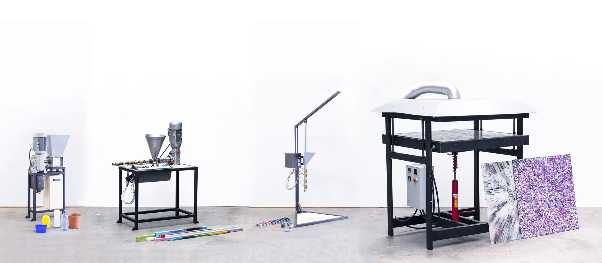

--- 
id: build 
title: Build 
sidebar_label: Intro 
--- 

（ビデオコンテナ）
</iframe> 

 
 

（ビデオ・チャプターズ 

（ビデオ・チャプターズ・メイン）
 
# マシンを作る 
### この機械は何ですか？ 
機械を作る時が来ました！このセクションでは、プレシャス・プラスティックで開発されたすべてのマシンをご紹介します。オリジナルで初心者にやさしいシュレッダー、インジェクション、コンプレッション、エクストルージョン、そしてバージョン4で開発されたより頑丈なマシン、シートプレス、シュレッダー・プロ、エクストルージョン・プロ 💪。 
各マシンの組み立て方、パーツの調達先、稼働に必要な機械や技術について概説しています。ビデオでは各マシンの組み立てについて詳しく説明し、必要なものはすべて各マシンのダウンロードパックに入っています。 
> プロからのアドバイス：1つのマシン、一連の技術、そしてアウトプットに集中すること。それをマスターして、プレシャス・プラスティック・ユニバースのエキスパートになろう！ 

 

（ビデオチャプターサイドバー 
### ビデオ・チャプター 
- 00:12 はじめに 
- 01:35 シュレッダー 
- 01:53 押出機 
- 02:33 圧縮 
- 02:57 注射 

 

 
 
## なぜこれらのマシンが重要なのか？ 
私たちはプラスチック加工機械を発明したわけではありません。プラスチック加工機械はすでに業界に存在しており、電光石火の速さで新製品を加工することができる。クリーンなバージンプラスチックを使う方が簡単で、安価で信頼性が高いのです。 
そこで私たちは、この業界のマシンをベースに、より安く、より簡単に、より手頃な価格で作れるようにした： 
 
このような包括的なアプローチは、アクセシビリティを高め、世界中で採用されています。また、基本的な技術と材料を使用して開発されているため、基本的な金属や建築技術を持つ世界中の人々が簡単に理解し、再現し、修理することができます。また、私たちは長年にわたり皆さん（私たちのコミュニティ）と一緒にこの活動を続けてきました。そのため、地元コミュニティでこれらのマシンを作る方法を理解し、地元の建設業者やサプライヤーのサポートを得ることは、これまで以上に簡単です。そして私たちは、皆さんがマシンをハックし、より良いものにしていく姿を見るのが大好きなのです！ 
> プロからのアドバイスマップを使用して、お住まいの地域にあるマシンを確認できます！ 
### 私たちのマシン 
機械の背後にある基本的な原理は、すべて同じです（シュレッダーを除く）。それぞれの機械がプラスチックに熱を加え、プラスチックが溶け、型や形に押し込まれ、最後に冷却されて固体の状態に戻る。これがリサイクルの背後にあるすべての魔法だ。とてもシンプルでしょう？それぞれの機械は、独自のワークフロー、結果、注意事項、行動、問題点を持っていますが、基本的なコンセプトは同じです。機械と一緒に仕事をすればするほど、機械に対する理解が深まり、リサイクルをより上手に行えるようになります。それでは、さっそく作業に入りましょう！ 
| Machines   |  Description | 
|----------|----------------------| 
|            | __Shredder__   Our Shredder chops the plastic into small flakes that can be used by the other machines to melt. Get the Shredder Pro for higher outputs.   | 
|         |  __Extrusion__   Shredded plastic goes in, gets molten and turns into a string of plastic. You can freestyle and wrap it around a mould or fill up moulds. Get the Pro version for higher outputs | 
|      |  __Injection__   Simple to build and use machine. Plastic melts in the barrel and is squeezed into a mould. You can make basic objects or super detailed. Good for education and small productions.   | 
|   |  __Compression__   An oven that can heat up your plastic in a mould and compress it together. It's good for experimenting and learning but not strong for productions. | 
|  |  __Sheetpress__   Big machine that can make big sheets. It can process a lot of plastic on a daily basis. It's a relatively new process, so there are still some things to learn and figure out :) | 
|  |  __Extrusion Pro__   A beefed up version of our smaller extruder. Made to run long hours and outputs more plastic. Its the extruder you can count on for big productions.   | 
|  |  __Shredder Pro__   Big version of our small shredder, the main difference is that this is a 2 axel machine. Good for quickly shredding plastic into small flakes. Less good for granulating.  | 
**助けが必要な人、質問がある人、孤独で寒い作業スペースで話せる人を探している人。Discordの[#build](https://discordapp.com/invite/XQDmQVT)チャンネルへどうぞ！ここでは機械についてオタクな話をします。 
