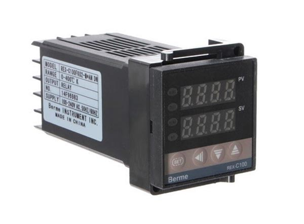
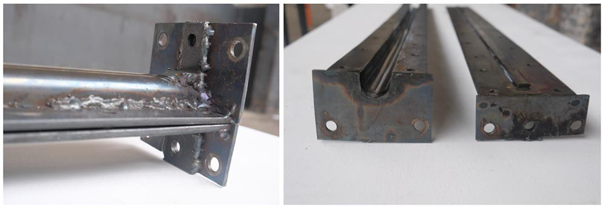

--- 
id: extrusionprobuild 
title: Build an Extrusion Pro 
sidebar_label: - Build it 
--- 

（ビデオコンテナ）
</iframe> 

 
 

（ビデオ・チャプターズ 

（ビデオ・チャプターズ・メイン）

# ♪押し出し成形のプロを作ろう 
エクストルーダープロへようこそ！このエクストルーダープロは、V3エクストルーダの、より強く、より大きく、より頑丈なバージョンです！これからエクストルーダーを始められる方や、より小型で簡単なマシンをお探しの方は、オリジナルのエクストルーダーから始めることをお勧めします。 
> もし精度が十分でなければ、複雑なパーツをバザーで探してみてください。精度が十分でない場合は、複雑な部品をバザーで探してみてください。 

 

（ビデオチャプターサイドバー 
### ビデオ・チャプター 
- 00:07 はじめに 
- 01:30 ベアリング本体とシャフト 
- 08:49 バレル注入口 
- 12:17 バレル 
- 15:13 モーター・アダプター 
- 16:35 ホッパー 
- 17:39 エレクトロニクス 
- 19:45 フレーム 
- 20:19 最終組立 
- 24:11 メンテナンスと走り方 

 

 
# 必要な機械と技術 
Build Extrusion Pro  | Machines needed | Skills needed 
--- | ---| --- 
  | - Lathe   - Drill press  - Milling machine   - Welding machine (TIG or MIG/MAG recommended)   - Torq wrench| - Welding (advanced)   - Machining (advanced)   - Assembling (intermediate)  - Electronics (intermediate) 
# 材料と部品 
### モーターの選択と説明 
モータの出力トルクは80～120Nmの範囲内で使用することを推奨します。最大出力トルクは120Nm、最小出力トルクは80Nmを推奨します。最大出力3kWのモータを使用することを推奨します。これは、最大（出力軸）回転数220～320RPMに相当します（ギアボックスとモータの効率を90％と仮定）。ウォームタイプのギヤボックスは効率が低いので避けることをお勧めします。 
モーターを購入する前に、あなたの国の標準的な電圧と周波数を知っておく必要があります。これらの数値は世界中で異なるため、モーターの輸入が複雑になる可能性があります： 
 
非同期モーターのカップリング（デルタまたはスター）は、設置場所の主電源電圧とモーターの定格電圧に依存します。設定が間違っている場合、モータは作動しますがトルクは低く、建物のブレーカーが落ちたり、モータが焼損したりする可能性があります。 
</img> 
ほとんどの可変周波数ドライブ（VFD）は、デルタ構成で接続されたモータで動作する必要がありますが、詳細についてはVFDのマニュアルを確認してください。 
 
### カップリング・オプションと説明 
少ないスペースで大きなトルクに対応できることから、押出スクリューのクランプにはシャフトロックコンクランプ方式が採用されました。また、押出機のコンポーネントのメンテナンスが簡単にできるように設計されています。ギアボックスへのカップリングの取り付け、取り外しも簡単です。最低250Nmのトルクに対応できるクランプを必ず使用してください。 
### ホッパー形状 
プラスチックの粒子径や形状に大きなばらつきがある場合を除き、四角いフィードホッパーはうまく機能する。ホッパーの底の形状は多くの要因に影響されます。ピラミッド型ホッパーは一般的に、比較的流動性があり、時間の経過とともに安定する製品や、ペレットサイズが均一なバルク原料に使用されます。円錐形の容器は比較的構造が簡単で、内部圧力を維持するのに優れた形状をしています。 
# 電子ボックス 
### 電気部品の役割の説明 
 
### PIDコントローラ： 
3つのPIDがヒーティングカラーの温度を制御します。それぞれが熱電対と対になっており、プロセス内の指定されたポイントの温度を測定する。これらの温度センサーは非常に頑丈で、低コスト、セルフパワーです。温度センサーには多くの種類があるので注意が必要です。最も一般的な熱電対モデルはJ、T、Kタイプの熱電対で、これらは既成の形で入手できる。 
### 熱電対センサーがPIDと同じタイプ(J,TまたはK)であることを確認してください。 
</img>
大半のPIDはデフォルトでタイプKだが、初期化モードを通じて初期設定を変更することで、他のタイプを使用できる場合もある： 
- PID REX C100 Page 7 Chapter 7.1 https://www.mpja.com/download/rex-c100.pdf 
### 周波数ドライバー： 
</img>
VFD（Variable Frequency Drive）は、モータの電気消費量、トルク、インピーダンスなどに影響を与えることなく、AC誘導モータの速度を制御するために特別に設計され、使用される精密電子機器である。     
#👌 作るときのコツ 
### 金型 
マシンのノズルでは、金型を取り付けるために異なるタイプの接続を使用することができます。カムロックとアリ溝はクイックリリース用途に適しており、スクリューノズルは高圧出力を必要とする製品に最適です。 
</img>
金型の温度によって、表面の仕上がりは異なります。予熱された金型は非常に滑らかな仕上がりになり、冷たい金型は波打つような仕上がりになります。 
</img> 
この機械で梁を作る場合、型が一杯になるとすぐにわかりますが、それ以外のものを作る場合は厄介です。私たちが見つけたコツをいくつか紹介しよう： 
- 材料の流量と鋳型の体積がわかっていれば、タイマーをセットする、 
- 小さな出口穴（1mm） 
- レンガには、ダブテール接続部にバイスグリップを使用している。圧力が十分に高くなると、バイスグリップが開き始め、完成を示す。 
より大きなものを作りたい場合、うまくいくテクニックは、金型に背圧をかけ、プラスチックが断面全体を満たすようにすることだ。高温のシリコーン・シールを使ったプランジャーは、これまで見つけた中で最も安価で簡単な解決策だ。圧力を強めたい場合は、プランジャーに重りを加えることができる。 
</img>
複雑な形状の梁や、収縮率の小さいプラスチック（PSなど）を使用する場合、2分割金型は、成形の解除を容易にする良い解決策となります。下の写真は、梁に溝を作るためのねじ付きフラットバーです。このような設計は、後加工の時間を短縮し、マイクロプラスチックの発生を防ぎます。 
</img> 
# 追加オプション 
### バレルサポート 
重量のある金型をマシンに取り付けて頻繁に使用する場合は、繰り返しかかる応力によって押出機が曲がってしまうのを防ぐため、バレルサポートが必要になる場合があります。 
技術図面はダウンロードキットにあります。 
</img>
### 加熱保護オプション 
火傷を防ぎ、ヒーティングカラーの空気中の熱拡散を最小限に抑えるため、押出機のバレルを覆うことをお勧めします。この保護には、薄い鋼板を手作業で切断して折り曲げます（折り曲げパターンには円筒形のものを使用できます）。 
技術図面はダウンロードキットにあります。 
あとは、バレルと鋼板の間に挿入する断熱材を使用する。さまざまな種類の断熱材を使用できる： 
- セラミック・ウール（ベスト・オプション） 
- ミネラルウール 
- ロックウール 
- グラスウール 
</img>
**助けが必要な場合、質問がある場合、孤独な寒いワークスペースで話せる人を探している場合。Discordの[#build](https://discordapp.com/invite/XQDmQVT)チャンネルへどうぞ。ここでは機械についてオタクな話をします。 
