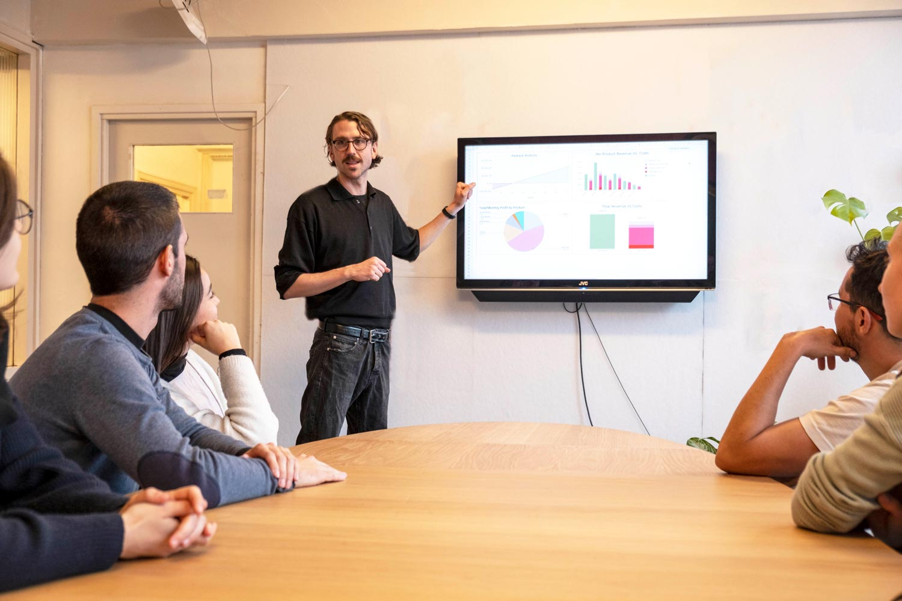

--- 
id: business 
title: Business 
sidebar_label: Intro 
--- 
 
 
# ビジネスツール 
### では、どうすればプラスチックのリサイクルで儲けることができるのか？ 
私たちは、あなたが地域社会にインパクトを与えるだけでなく、経済的に持続可能で、長く続けていくことができるようになるための重要なツールを紹介することに興奮しています。ジョセフ（私たちのビジネス・ガイ）が、何もないところからビジネスを立ち上げるための以下の3つのツールをご紹介します！ 
> プロヒント：最も成功したビジネスとは、顧客や聴衆に何を届けたいかに本当に集中しているビジネスである。 
 
## ビジネス・ツールは3部構成： 
- <b>アクション・プラン</b>は、あなたのビジネス・モデルを計画するための、迅速で汚いビジネス・プランです。 
- <b>ワークスペース計算機</b>は、ワークスペースの財務的な実行可能性を理解するための財務予測ツールです。 
- <b>ビジネスプラン・テンプレート</b>は、すべてをまとめて、より長い形式のビジネスプランを作成する場所です！ 
始めよう！ 
