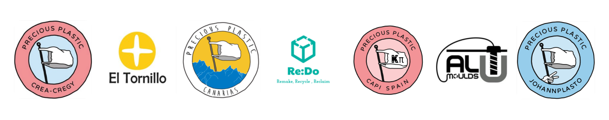
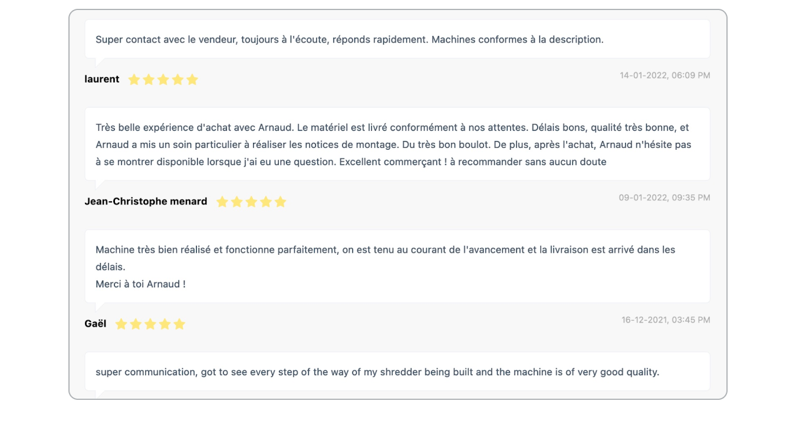

--- 
id: Account_Setup 
title: Account Setup 
sidebar_label: Set up account 
--- 
 
# セラーアカウントの設定 
プレシャスプラスチックバザールでの販売を開始したいとはクールですね！売り手アカウントに**[サインアップ](https://bazar.preciousplastic.com/index.php?dispatch=companies.apply_for_vendor)**して、アカウントの承認メールを受け取りましたか？それでは、正しくセットアップするための手順を説明しましょう！ 
バザーでビジネスを構築し強化するためには、信頼できるユニークなプロフィールを持つことが重要です。 
**魅力的なプロフィールを設定するためのガイドラインをいくつか紹介しよう。 
> 情報適切な出品者プロフィールを持つ出品者のみが**ホームページ、ニュースレター、ソーシャルメディア**で宣伝されます。 
## 1.販売者プロフィールに移動する 
販売者[ダッシュボード](https://bazar.preciousplastic.com/vendor.php?dispatch=auth.login_form&return_url=vendor.php)にログインし、販売者プロフィールを開きます。 
 
## 2.プロフィール情報の入力 
- ご自身のプロフィール情報が正確かどうかご確認ください。 
- また、**あなたの場所を追加**して、売り手にあなたのピンを作成します。 
[地図](https://bazar.preciousplastic.com/index.php?dispatch=companies.catalog)。これは、あなたの地元のコミュニティがあなたを見つけるのに役立ちます。 
 
## 3.説明を加える 
 
詳細な説明は、潜在的な買い手があなたとあなたの組織を知るのに役立ちます。どのように起業したのか、何に重点を置いているのかなど、あなたのストーリーを伝えましょう。 
あなたのビジネスの完全な説明を記載する必要があります： 
* あなたが誰であるか 
* 何を目指しているのか（ミッション／モチベーション） 
* 御社の主な事業内容 
* 過去の参考文献など 
さらに、あなたのワークスペースやお店の写真を追加することで、個性を演出し、より良い印象を与えることができます。 
> あなたのビジネスに関する詳細を顧客に提供し、顧客にあなたのプロフィールを信頼してもらい**安心して商品を購入してもらえるような関連情報を提供する。 
 
## 4.ロゴを追加する 
 
アカウントにロゴをアップロードして、あなたのプロフィールをわかりやすくしてください。会社のロゴを使用することをお勧めします（ロゴがない場合は、[ロゴジェネレーター](https://community.preciousplastic.com/academy/universe/yourlogo)で作成できます）。 
 
- 最初のロゴは、あなたのプロフィール写真として表示されます。 
- 2つ目のロゴは、顧客への請求書に表示されるものです。 
ロゴの推奨サイズは**250x250ピクセル**で、合計サイズは**5MB**以下でなければなりません。 
## 5.支払い方法を選べる 
バザーで販売するためには、少なくとも1つの支払い方法を設定する必要があります。 
潜在的な顧客グループを増やすために、**クレジットカードとPaypal**の両方の支払いオプションを設定し、潜在的なニーズのほとんどに対応するようにしてください。 
お支払い方法の設定方法について詳しくは、「お支払い方法の設定」(https://community.preciousplastic.com/academy/business/Setup_Payment)をご覧ください。 
 
# ♪ 準備万端？リスト作成の時間です！ 
これらのステップをすべて満たしていれば、あなたのプロフィールはバザー**で売れ、**うまくいくようにうまく設定されているはずです。 
出品したい商品をアップロードしてください。出品を最大限に活用し**、売上を上げ、ホームページで宣伝されるチャンスを増やすには、[**Guidelines for creating good Bazar listings**] (https://community.preciousplastic.com/academy/business/Image_Size_Guidelines)に従ってください。 
## レビューを見る 
顧客からのレビューは、購入体験を反映し、あなたのコミュニケーションの質、商品の品質、配送経験などについてフィードバックすることができます。これらは一般に公開され、あなたのポートフォリオとして機能し、潜在的な顧客**があなたから買うか買わないかを決める**指標となります。 
したがって、お客様とのやり取りを通じて**高いサービス品質**を確保することを強くお勧めします。 
お客様が自分でレビューを残さない場合は、**注文ステータスを "レビュー待ち "**に設定することができます。   
 
## 質問は？ご意見は？ 
また、重要なヒントや情報を見逃していると思われる場合は、遠慮なく直接お問い合わせください。 
Discordの[#🙌bazar-sellerチャンネル](https://discord.gg/2E93VxB3CD)、または**bazar@preciousplastic.com**までメールをお送りください。 
