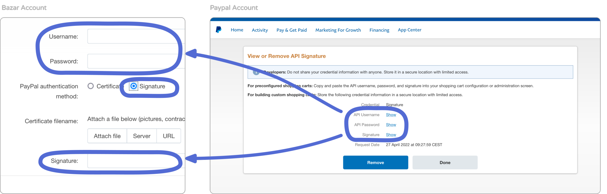

--- 
id: Setup_Payment 
title: Setup payment 
sidebar_label: Set up payment 
--- 
 
# 支払い方法を設定する 
Bazarで販売するためには、支払いが適切に設定されていることを確認する必要があります。Bazarでは決済代行会社として[Stripe](https://stripe.com/en-gb-de)と[Paypal](https://paypal.com/)を提供しています。支払い、払い戻し、請求書を管理するために、少なくともどちらかのアカウントが必要です。 
 
# Stripe アカウントに接続する 
まずはじめにBazarアカウントをStripeに接続するには、Stripeアカウントが必要です。 
まだお持ちでないですか？[Stripeアカウントを設定する](https://dashboard.stripe.com/register) 
- アカウント作成は無料 
- Stripeがサポートする[国](https://stripe.com/global)に登録された組織が必要です。 
- あなたの国がサポートされていない場合は、Stripe [Atlas](https://stripe.com/atlas)を通してアカウントを設定してみるか、別のクリエイティブな方法を見つけてください。 
設定が完了したら、BazarアカウントとStripeアカウントを接続します。 
## ステップ1：支払い方法の追加 
- [セラーダッシュボード](https://newbazar.preciousplastic.com/my_admin_panel.php)にログインします。 
- 管理/お支払い方法へ移動します。 
- をクリックして追加する。 
 
## ステップ2：プロセッサー（ストライプ）の選択 
- プロセッサーとしてStripeを選択し、その他の必要情報を入力してください。 
- 次に「設定」をクリックする。 
 
## ステップ 3: ストライプへの接続 
- configure」の情報を入力する 
- ストライプアカウント/デベロッパー/APIキーで、公開可能なキーとシークレットキーを検索します。 
 
## ステップ4：終了！ 
- Create」をクリックすると、支払い方法が表示されます。 
  
 
# ペイパルのアカウントに接続する 
[Paypal](https://paypal.com/)は、多くの国でアクセス可能な非常に広く使用されている決済ツールです。ペイメントとの競合を避けるために、Stripeの支払い方法に追加して提供するのが良いでしょう。 
## 必要条件ペイパルビジネスアカウント 
バザーでPaypalを使用するには、アクティブなPaypalビジネスアカウントが必要です。 
もしお持ちでない場合は、[作成](https://www.paypal.com/bizsignup/#/checkAccount)して、必ずEメールアドレスで認証してください。 
## ステップ1：支払い方法の追加 
- [セラーダッシュボード](https://newbazar.preciousplastic.com/my_admin_panel.php)にログインします。 
- 管理/お支払い方法へ移動します。 
- をクリックして追加する。 
 
## ステップ2：プロセッサー（Paypal）の選択 
- プロセッサーとして「Paypal Express Checkout」を選択します。 
- 次に「設定」をクリックする。 
 
## ステップ3：技術的な詳細を記入 (1) 
- テクニカル詳細**フィールドまでスクロールダウンしてください。 
- Paypalアカウントの[ビジネス情報](https://www.paypal.com/businessmanage/account/aboutBusiness)で、**マーチャントID**を検索します。 
- それを技術詳細にコピーする 
 
## ステップ4：技術的な詳細を記入 (2) 
- [API アクセスの管理](https://www.paypal.com/businessprofile/mytools/apiaccess/firstparty) で、**ユーザー名、パスワード、署名** をリクエストしてください。 
- それを技術詳細にコピーする 
**名前と数字をコピーするときは、数字と文字だけをコピーし、空白はコピーしないようにしてください。 
 
## ステップ5：技術的な詳細を記入 (3) 
- ライブ」モードを選択 
- チェックアウトでPaypalオプションを表示するボックスにチェックを入れる 
 
## ステップ6：終了！ 
- 作成」をクリックする 
- 支払い方法が表示されます。 
 
## You're now open for business 🎉 ## 
これでバザーに出品して販売を開始することができます。幸運を祈ります。🙌🏼 リスティングをアップロードする前に、最後の重要なポイントをご確認ください！ 
# バザール料金 - 地域社会への5 
私たちはバザールのサービスを無償で提供したいのですが、現実はそうではありません：バザールのようなプラットフォームの運営、維持、改善には、多くの資金と人的資源が必要です。 
そのため、バザー手数料というものがあり、各販売額の5％が徴収される。 
手数料は、プラットフォームのホスティング、バグフィックス、売り手と顧客に対するテクニカルサポート、そして最良の場合にはプラットフォームの改善と開発に使用される。 
あなたの大切なものをバザーに出品することで、このプラスチックリサイクル市場が、プラスチックリサイクル業者にとって利用しやすく、スムーズな売買ができるようになり、リサイクル事業の成功に貢献することにもなるのです。） 
> 毎月請求書をお送りし、その月の販売額の5％を請求させていただきます。このことを念頭に置き、商品価格に反映させてください！ 
# リストを作成する時間 🎁。 
プロフィールと支払い方法は設定されていますか？ 
そして、いよいよ売りたい商品をアップロードします。出品を最大限に活用**し、販売チャンスを増やし、ホームページやニュースレター、ソーシャルメディアで宣伝するためには、[**Guidelines for creating good Bazar listings**] (https://community.preciousplastic.com/academy/business/Image_Size_Guidelines)に従ってください。 
## 質問は？ご意見は？ 
また、重要なヒントや情報を見逃していると思われる場合は、遠慮なく直接お問い合わせください。 
Discordの[#🙌bazar-sellerチャンネル](https://discord.gg/2E93VxB3CD)、または**bazar@preciousplastic.com**までメールをお送りください。 
