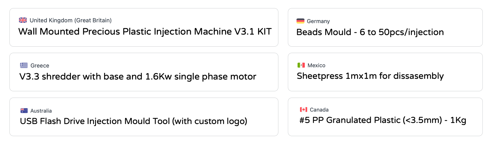
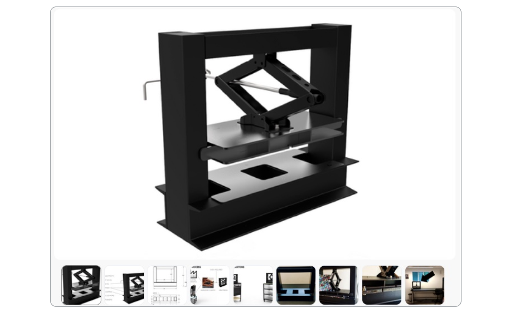
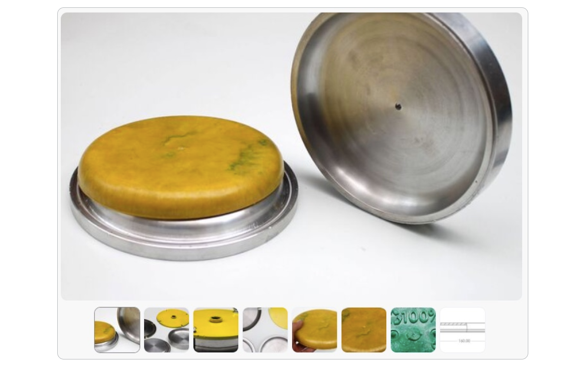
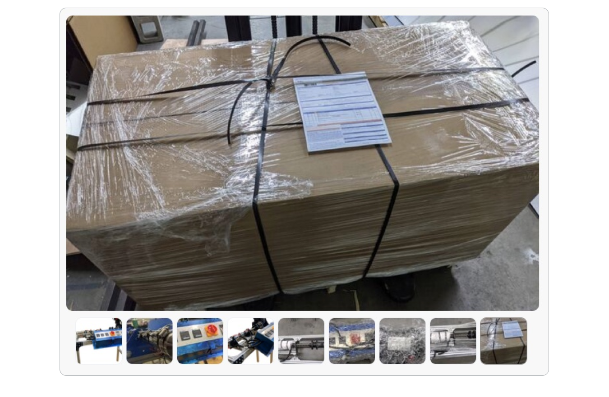
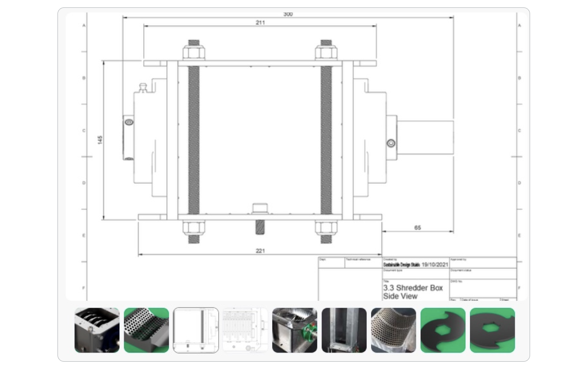
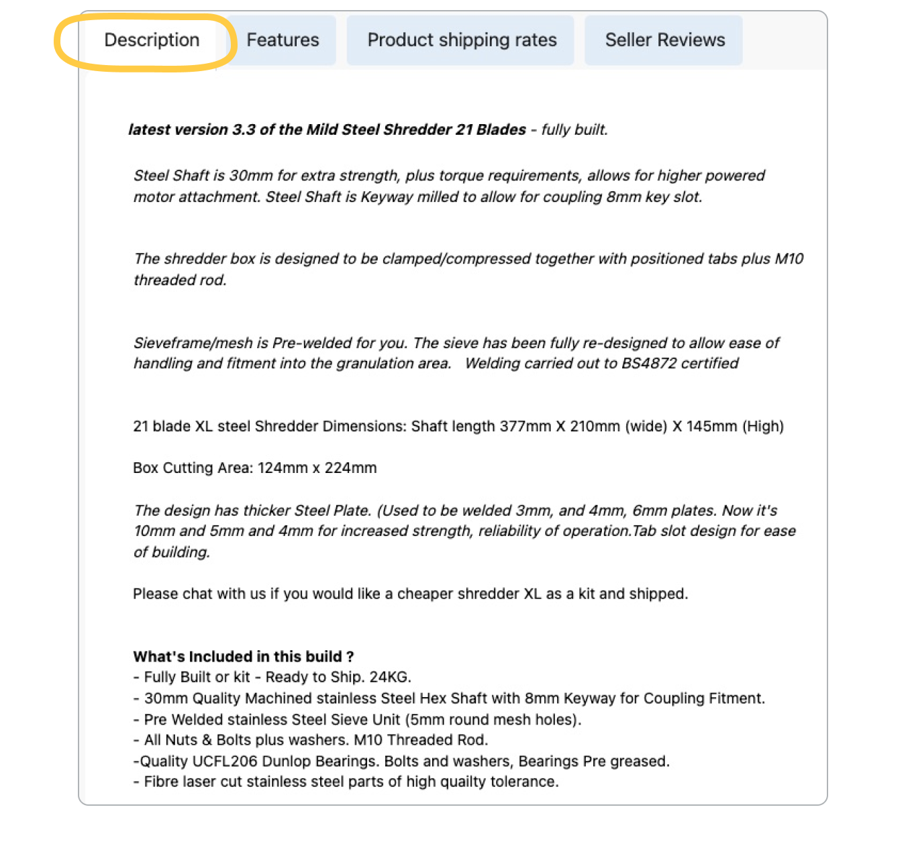
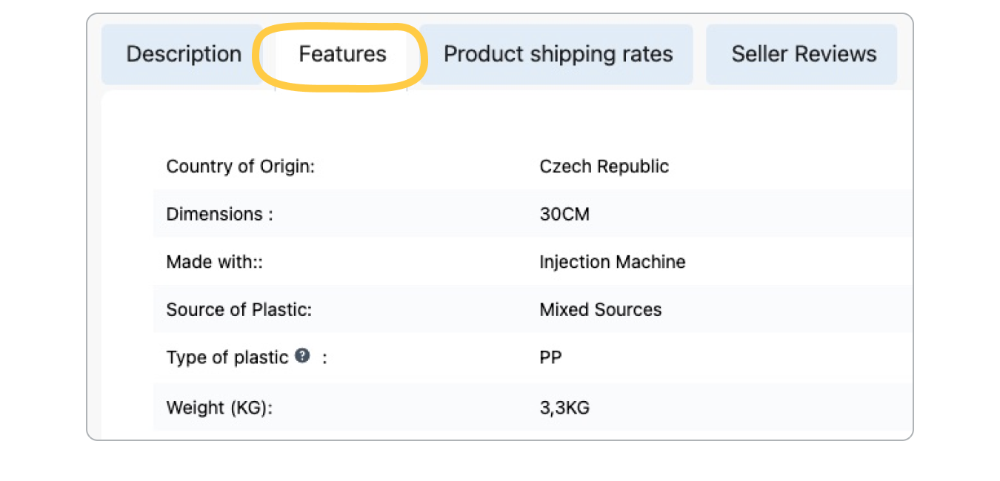
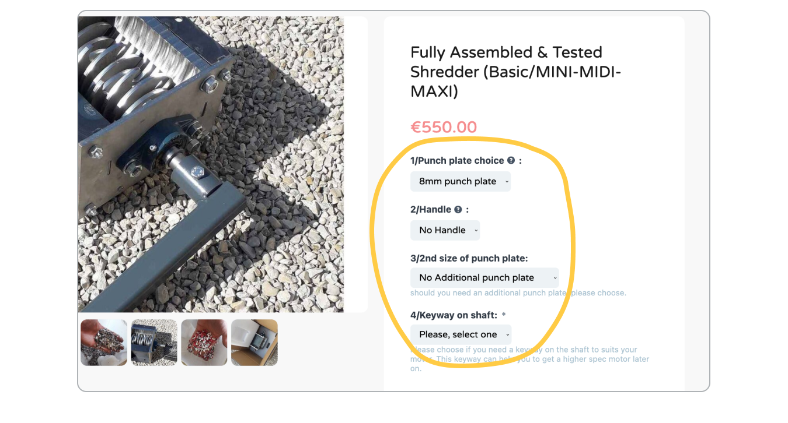
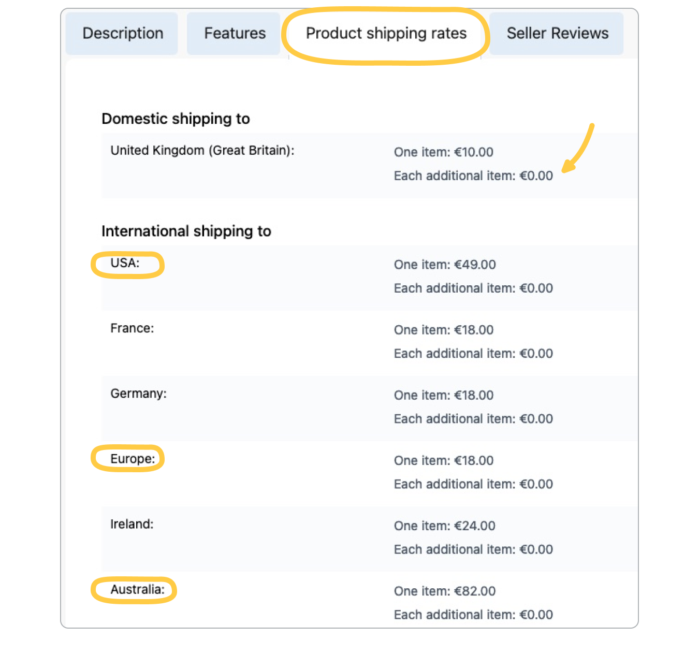

--- 
id: listing_guidelines  
title: Listing guidelines 
sidebar_label: Listing guidelines 
--- 
 
# バザーに貴重なリストを作成する 
リスティングに愛情を込めることで、顧客を惹きつけ、あなたの仕事の質を信頼してもらうことができる。 
また、バザーの質の高いコンテンツは、バザーの全体的な経験をより成功に導き、その結果、ユーザーをより幸せにし、すべての人に**より多くのトラフィックと売上をもたらします！**。 
>良いリスティングは、ホームページやニュースレター、ソーシャルメディア**で宣伝されるチャンスもあり、知名度や売上アップにつながります。 
**このビデオ](https://www.loom.com/share/b1df010a31b04a79b034f723b579cc4e)では、考慮すべき重要な要素について説明します。 
## 1.アイテムタイプ 
このバザールのために作られたものにこだわってください：プラスチックリサイクル機械、金型、原料、リサイクルプラスチック製品。サービスの提供はお断りします。 
## 2.タイトル 
商品のタイトルは、できるだけわかりやすく、商品の本質的な要素を含むものにしましょう。情報が多すぎず、お客様が探しているものなのかどうかがすぐにわかる程度にしましょう。 
 
# # 3. 
画像の内容と質は、リスティング広告を**情報豊富で説得力のある**ものにするために、おそらく最も重要で強力な要素の1つです。 
最大限の視認性を確保するため、横長の画像を強く推奨します。最低推奨掲載画像サイズは**794×1000ピクセル**で、解像度は72ppiです。 
 
### 3.1 マルチアングル 
様々な角度からの写真を掲載し、商品の全体像、構成要素、プロポーションがわかるようにすること。 
サイズやプロポーションがわかるように、**きれいな写真**と、**背景がわかる写真**の両方を用意するのがよい方法です。 
 
### 3.2 クローズアップとワイドアングル 
クローズアップだけでなくワイドアングルでも、商品のディテールや品質を感じ取ることができる。 
 
 
### 3.3 出荷箱（寸法を含む） 
特にマシンを購入する際には、輸送箱の写真と寸法を添付しておくと非常に便利です。 
これは、顧客が商品を受け取る際に**何を期待すればよいのか**、また、商品を降ろすために特別な設備が必要かどうか（例：配送パレット、フォークリフトの必要性）を知るのに役立ちます。 
また、このステップを経験したことがあることを示し、より**信頼**されるようになる。 
 
### 3.4 CAD図面 
もし可能であれば、機械、金型、品目のCADや技術図面を共有することも役立ちます。 
これにより、**正確な寸法と組み立て**をよりよく理解することができ、お客様の既存の機器がお客様の商品と互換性があるかどうかを評価するのに役立ちます。 
 
# 4.概要 
写真と同様に、**明確で詳細な商品説明**を用意することで、顧客は自分が何を買っているのかを疑うことなく理解することができ、顧客からの問い合わせ率を下げることにもつながります。 
買い手は、すべての主要な特徴、寸法、条件などを明確に理解できなければなりません。**- 買い手が購入するかどうかを判断できるように。 
**商品説明に他のプラットフォームへのリンクを含めないでください。バザーでサポートされていない、例えばPDFドキュメントのような、アイテムの詳細を説明するコンテンツへのリンクは受け付けます。 
該当する場合は、利用規約も記載することができます。 
 
## 5.特徴 
Precious Plastic Bazarが提供する機能セクションを完成させることで、顧客は購入する商品についてよりよく理解し、あなたの店との信頼関係を築くことができます。 
できるだけ多く、理想的にはすべて**記入してください。 
 
# # 6. オプション 
顧客のニーズに合わせて商品をカスタマイズする**絶好の機会があります**（人々はそれが大好きです！）。さらに、顧客がクリックして購入するのを助け、摩擦を減らし、コンバージョン率を高めます。 
いくつか例を挙げよう： 
金型は**スクリューか**テーパー**ノズルのどちらかに合わせなければならないかもしれない。 
* シュレッダーには、**異なる穴サイズ**のふるいが付属していることがある。 
* 商品には**異なるカラーレンジ**がある場合があります。 
顧客は自分にとって**ぴったり**のものを選ぶのが好きなので、複数の選択肢があるリスティングの方が一般的にうまくいく。 
 
## 7.配送オプション 
配送オプションが多ければ多いほど、より幅広い顧客**にリーチすることができます。 
世界中の配送オプションをカバーする最も簡単なオプションは、**各最大地域**（米国、南米、ヨーロッパ、アフリカ、ロシア、アジア、オセアニア）の配送価格を設定することです。 
地域ごとに設定していない場合は、**できるだけ多くの国**への配送を提供するようにしてください。  少なくとも**ヨーロッパとアメリカ**の発送オプションを用意することをお勧めします（バザーで最もアクティブなユーザーグループだからです）。 
> バザーは、ヨーロッパとアメリカへの発送が可能な商品のみ**販売することができます。 
また、**追加アイテム**ごとに価格を設定することに注意してください（特に機械の場合、数量が2倍になると送料も2倍になる可能性が高いです）。 
配送と地域については、[**配送オプション設定ガイド**](https://community.preciousplastic.com/academy/business/International_Shipping)をご覧ください。 
 
# 特集を組みたい？✨ 
以上が、**バザー**でリスティングがうまくいくためのガイドラインです。頑張ってください！ 
私たちは素晴らしい作品を紹介するのが大好きで、作品やバザーへの掲載に愛情を注いでいるセラーを応援しています。もし、あなたの作品をホームページやEメール、ソーシャルメディアに掲載したい場合は、ガイドライン[**掲載方法**](https://community.preciousplastic.com/academy/business/regions)に従ってください。 
## 質問は？ご意見は？ 
また、重要な情報やヒントを見逃したと思われる場合は、遠慮なく直接お問い合わせください。 
Discordの[#🙌bazar-sellerチャンネル](https://discord.gg/2E93VxB3CD)、または**bazar@preciousplastic.com**までメールをお送りください。 
