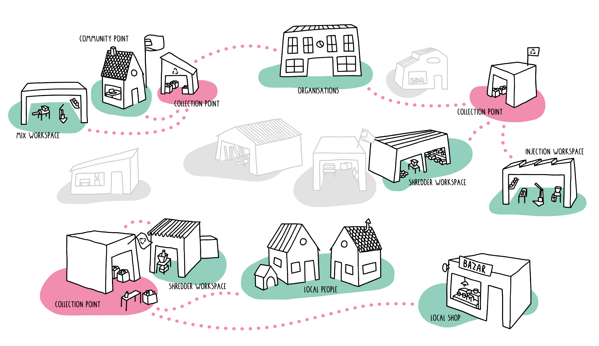

--- 
id: collect 
title: Collect 
sidebar_label: Our Collection System 
--- 

（ビデオコンテナ）
</iframe> 

 
 
# 世界的な収集システム 

（ビデオ・チャプターズ 

（ビデオ・チャプターズ・メイン）
 
### 回収もリサイクルもしない！ 
プラスチックを回収することは非常に重要だ。ここでは、プラスチックを回収するとはどういうことか、世界中でどのように行われているのか、そしてプレシャス・プラスティック・ユニバースではどのような回収システムを考えているのかを紹介しよう！ 
> プロからのアドバイス：周りのお店や企業に、余分なプラスチックゴミがないか聞いてみましょう。ゴミ箱を用意すれば、分別してくれるかもしれない！ 

 

（ビデオチャプターサイドバー 
### ビデオ・チャプター 
- 00:19 廃棄物収集 
- 01:21 現在の状況 
- 02:05 チャレンジ 
- 02:32 プレシャス・プラスチック・プラン 
- 03:00 戦略 
- 03:42 このアプローチの利点 
- 04:26 ツール 

 

 
# 廃棄物収集 
 
私たちは日常的に、大量のプラスチックを購入し、使用し、排出している。これらのプラスチックは、通常はごく短期間使用された後、廃棄されます。お住まいの地域にもよりますが、地元のリサイクル・ポイントに投函するか、回収業者が自宅から回収し、さらに処理することになります。通常、問題はここから始まる。 
リサイクルされているのでしょう？さて、人々がリサイクル容器に捨てるプラスチックは、分別されておらず、たいてい汚れていて、しばしば他の素材と混ざっている（例えば、フィルムのラベルが付いたソーダボトル）。すでに学んだように、プラスチックの分別は適切なリサイクルの基本である。赤外線スキャン、水密度技術、手作業によるピッキングなど、工業的な分別は可能だが、毎年生産される3億4,800万トンを分別するには効率が悪い。そうだ。 
### オーケー。それは厳しいな。それでどうなるんだ？ 
プラスチックがリサイクルされることもある。どこかで読んだことがあると思うが、その割合は約9％である。非常に複雑で、高価で、時間とエネルギーを要するプロセスを経る必要があり、ほとんどの国にはその選択肢すらない。 
</img> 
もうひとつの、より可能性の高いシナリオは、プラスチックは燃やされるか、埋め立て地に送られるか、海に捨てられるか、貨物船でアジアやアフリカに送られるかのいずれかである（そこではプラスチックを処理するインフラがないことは確かだ）。これらの解決策は、大きな環境破壊と社会的抑圧を引き起こす。ゴミなんてどこにも落ちていない！欧米諸国の街はきれいだ。しかし、アジアやアフリカのある場所では、ゴミは汚く、ポイ捨てされているように見える。それは、回収システムを国が税金で補助しなければならないからで、多くの場所では不可能なのだ。しかし、これを混同してはいけない。西側諸国は依然として地球上で最大のプラスチック廃棄物排出国なのだ。その上、世界の回収システムは標準化されていない。国や自治体によって規制が異なるのだ。このため、人々は（私たちも含めて）非常に混乱している。 
## チャレンジ 
現在のプラスチックの回収方法には多くの課題がある： 
- 回収されたプラスチックは汚れていたり、他の物質と混ざっていることが多い。 
- 24時間365日、トラックとドライバーの一団を市内に走らせるのは、莫大なコストがかかる。 
- 使い捨て文化を助長する（？） 
# でも心配しないで！💪 
## 貴重なプラスチック回収システム 
プレシャス・プラスチックの活動は、私たちと同じように、皆さんと同じように、行動を起こしている人々に焦点を当てています。私たちと同じように、あなたと同じように、行動を起こす人たちです。私たちは、あなたがプラスチック廃棄物により深く関与し、解決策の一部となるよう呼びかけます。情報とインフラを提供することで、地域社会は変革の道具となるのです。 
では、プラスチックの回収にはどう使うのですか？いい質問ですね😉。 
 

注意：私たちが市民と言うとき、それは社会のすべての人を意味します。私たちのコミュニティの人々というのは、プレシャス・プラスチックのコミュニティの一員となった人々のことです（まだの方は、ぜひご参加ください！）
。 
<b>One.</b>私たちは、人々が家庭でプラスチックを適切に洗浄するために必要なすべての情報を提供し、その後、適切にリサイクルされるように、人々がプラスチックを持ち込める場所を紹介します。教育は私たちが行うすべてのことの核心であり（知識＝力）、ラベルのない清潔なプラスチックの重要性を市民に教えることだけでも、大きな変化を生み出すことができるのです。 
<b>2つ目</b> 私たちは地域の人々に、市民から回収されたきれいなプラスチックを受け入れるための回収ポイントの作り方を教えています。私たちはラベルのないきれいなプラスチックだけを受け入れているため、この素材がいかに貴重なものであるかを市民や地域社会に示すことにもなるのです。 
## このアプローチの利点 
この新しいアプローチは、人と環境の双方にいくつかの異なる利点をもたらす： 
1.第一に（そして最も重要なのは）、<b>収集される材料が高品質であることである。</b>地域社会のメンバーによって管理される地元の収集拠点を設置することは、清潔で使用可能な、より高品質の材料を得るのに役立つ。 
2.第二に、<b>地元にとどまる。</b>回収されたプラスチックは、地元のプレシャス・プラスチックのワークスペースのひとつでリサイクルされ、生まれ変わる。 
3.3つ目は<b>教育</b>である。このアプローチは、プラスチックとそれを適切にリサイクルする方法について市民に知らせ、教育することを目的としている。  これは長期的な戦略であり、最初のうちはかなり時間がかかるが、長期的には報われると信じている。 
第四に、政府や企業ではなく、人々によって支えられている。だから、弾力性があり、人間的で、アクセスしやすい。 
# ツール 
参加しますか？私たちはそう願っています！私たちは、市民や地域の人々のためにたくさんのツールを開発しました。 
市民の皆さんには、プレシャス・プラスチックのリサイクル・システム、プラスチックの洗浄方法、お近くの投棄場所を見つけるための地図の使い方などを紹介するウェブサイトを用意しています。 
 
地域の人々にとって、私たちは発展してきた： 
- <b>スターター・キット：</b>コレクション・ポイントになることに興味があるなら、これを使えば始めるのに必要なものがすべて揃う。 
- コミュニティのみんなをつなぐ<b>プラットフォーム</b>。マップを使って地元のワークスペースを探したり、ハウツーツールで世界中の他の収集戦略を学ぶことができる。 
- <b>ポスター</b>は、あなたのワークスペースや地域社会に掲示し、この言葉を広めるのに役立ちます。 
- <b>あなたが処理したプラスチックの量を量るツール</b>。 
<b>フィードバックを共有したり、プラスチックの収集についてチャットしたり、コミュニティからもっと学びたいですか？Discordの[#Collect](https://discordapp.com/invite/kpnYaEr)チャンネルへどうぞ。ここでは、収集システム、ピックアップポイント、プラスチックの分類方法について話しています</b>。 
