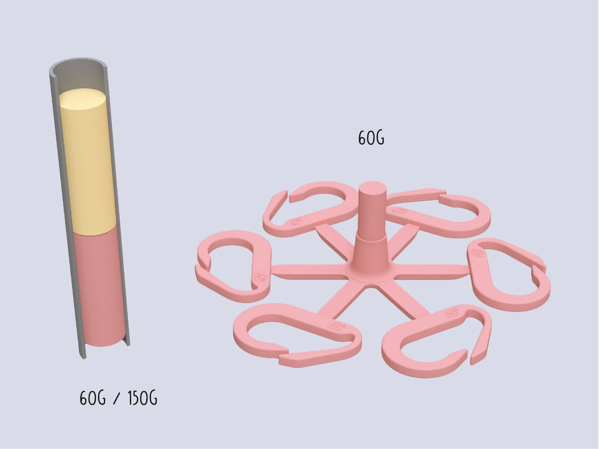
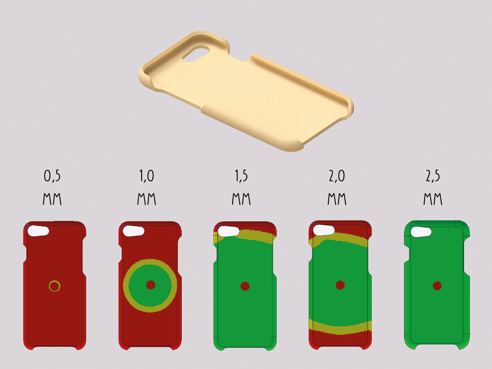
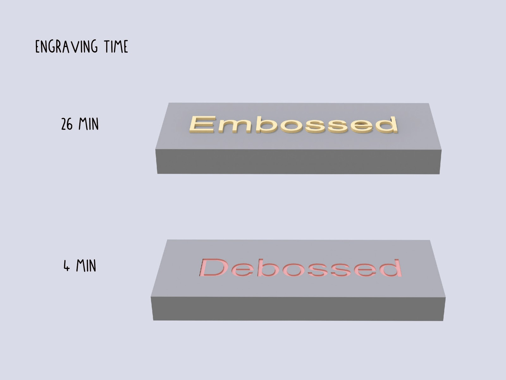
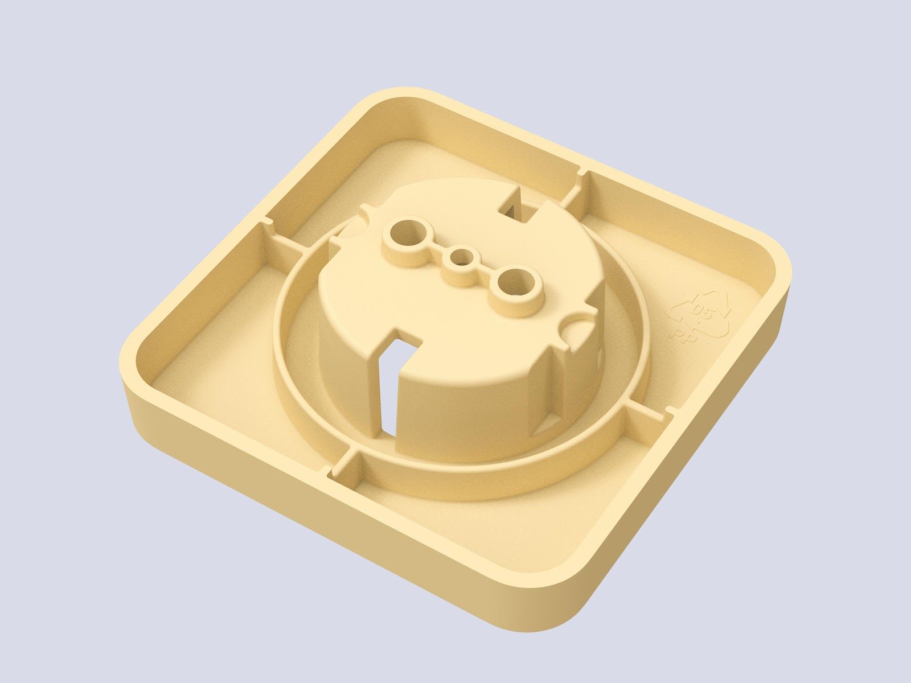
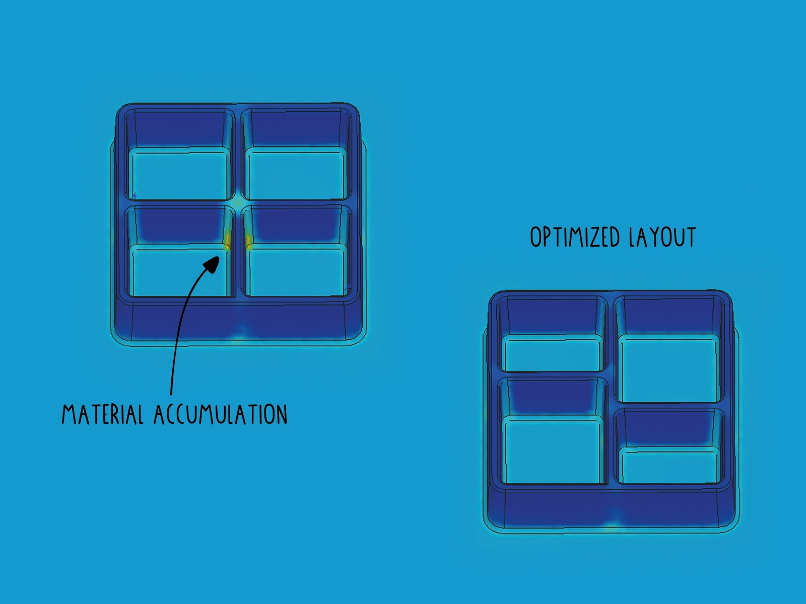

--- 
id: injection-moulds 
title: Tips on injection mouldmaking 
sidebar_label: Injection moulds 
--- 
 
</img>
# 射出成形金型製作のヒント 
基本的に、シートであれ、ビームであれ、何かを作るにはすべての機械に金型が必要です。金型を使う最も汎用性の高い機械は射出成形機ですが、射出成形機にも限界があります。何も恐れることはない！ただ、設計上の制約を知ることが重要なのです。それでは、長所と短所から始めましょう： 
| Pro    |     Cons   | 
|----------|-------------| 
| Ideal for small volume parts <150cm³> |  Moulds can be expensive | 
| Short cycle times (<2-5min>) |   Complicated process with many uncertainties   | 
| Multiple cavities enable faster production |     Volume not enough for bigger parts   | 
| Reliable production of parts   |   Parts with thin walls need more pressure than the current machine can offer   | 
| Very detailed parts can be achieved | Mainly suited for HDPE and PP	| 
| Advanced parts can be designed by the use of inlays and sliders|	| 
## 型を作るための材料 
まだここにいるのか？素晴らしい！小型金型の最も一般的な材料はアルミニウムで、鋼鉄よりも加工しやすく、他の材料に比べて比較的寿命が長いからです。また、金型の製造にはさまざまな製造工程があり、それぞれに長所と短所があります。ここではその概要を説明します： 
| Material    |     Application   | Accuracy | Accessibility | Costs | Lifetime (shots) | 
|----------|-------------|-----|-----|-----|-----| 
| Wood/ MDF| Not recommended (plastic sticks to the mould) |Low- Medium|High|Low (<100€>)|-| 
| Acryl (CNC/ Lasercut) |   Demonstrations/prototyping   |Low- Medium|High|Low (<100€>)|5-10| 
| Silicone Casting |     Prototyping  |Low|High|Low (<100€>)|Up to 20| 
| SLA Printing (High Temp resin)   |   Prototyping, Small Series   |Medium| Medium |Medium (>200€)|Up to 100| 
| [Aluminium (Casting)](https://youtu.be/5LhHUBz9uL0)  |	Moulds for organic Geometry  |Low - Medium|High|Low (<100€>)|Up to 2000 - 10.000| 
| [Aluminium (Machined)]( https://youtu.be/ZYFoWP-3MYE)   | Small Series, Medium Series	|High|Low|Medium (>200€)|Up to 2000 - 10.000| 
| [Steel (2D Lasercut)](https://youtu.be/P_zCIXsHkVI )  | Prototyping - Big Series	|Medium (Lasercut)|Medium|Low (<100€)|Up to 100.000| 
| [Steel (Welded)](https://youtu.be/dYG7qcGp5mc )    | Prototyping - Big Series	|Low- Medium|High|Low (<100€)|Up to 100.000| 
| Steel (Machined)    |Big Series|Very High|low|High (>1.000€)|Up to 100.000| 
# 部品と金型の寸法 
可能な最大部品サイズは複数の変数によって定義される： 
1.最大容積→部品の容積（スプルー、ゲート、ランナーを含む）は150g以下ですか？ 標準v3射出成形機の場合）。130gを超えると、プラスチックの圧縮が必要になり、サイクルタイムが短くなります。フレークの体積は、プラスチックの溶融体積よりも大きい： 
   
  
2.金型の総サイズ→私の射出成形機で使えますか？ 
(v3射出：直径380mm x 170mm) スクリューノズルと長方形の金型を使用する場合は、最大幅/長さの対角線距離を考慮してください！ 
   
 
3.部品の深さ→標準的なエンドミルで加工できるため、～40mm以下であれば最も簡単。ほとんどのエンドミルは長さ100mm程度が限界。Z-Travelの少ないホビースタイルのCNCマシンを使用する場合、関連する可能性がある。80mm以下であれば、金型は通常1つのブロックから加工できます。これは大きなコスト削減になります。   
4.すべてのキャビティ、ランナー、ゲートの金型開口方向への投影面積。これにより、必要な型締力が決まります。これは、手動射出成形機で射出される部品設計では問題ではありません。もしあなたの部品がより高圧の射出成形機で製造されるのであれば、このことをより詳しく考慮する必要があるかもしれません。   
 
> ヒント：早い段階で製品の製造上の制約を考えておくと、将来的に時間と費用を節約できます。金型製作のコストを削減するためには、すべての機能をできるだけ大きく、浅く設計する必要があります。 
## 縮みと公差 
すべての熱可塑性ポリマーは、溶融状態から冷えると収縮する（下表参照）。 
収縮率は、材料と金型のプランニングに非常に関係します。材料は通常、パーツの中心に向かって収縮するため、中心部に切り込みや高いフィーチャーがあると、パーツが金型にはまり込んでしまう可能性があります。 
収縮率を考慮することは、特に他の部品との公差が小さい微細な形状の場合、非常に重要です。収縮率は、材料内部の（未知の）添加物に基づいて、与えられた範囲内でも変化する可能性があります。 
  
| Material    |     Shrinkage Rate   | 
|----------|-------------| 
| HDPE |  3,3% | 
| LDPE |   3,8%   | 
| PP |     2,6%   | 
| ABS, PC, PMMA   |   0,6%   | 
| PS | 0,5%	| 
  
   
## ドラフト角度 
金型から部品を簡単に取り出すには、開口方向に平行なすべての面に抜き勾配が必要です。これにより、部品を簡単に型から外すことができます。 
一般的なドラフト角度は2°ですが、高さのあるフィーチャーでは5°まで使用できます。フィーチャーの高さ25mmごとに1°の抜き勾配をつけることを推奨します。抜き勾配が大きいほど、金型からパーツを排出しやすくなります。部品に抜き勾配をつけることは「自然」なことではなく、機械工学や工業デザインの設計目標とは相反することが多いので、設計目標や技術目標を達成しながら、できるだけ多くの抜き勾配をつけることが目標です。0.5°の抜き勾配でも、生産に大きな違いをもたらします。 
> プロからのアドバイス：サーフェスにテクスチャーを加える場合は、ドラフト角度を3～5°にするよう注意してください。 
市販されている多くのソフトウェアパッケージには、ドラフト解析機能があり、特に1つの部品の多くの面をドラフト角度でチェックする必要がある場合に非常に便利です。特に1つの部品で多くの面を抜き勾配でチェックする必要がある場合に便利です。下の画像をご覧ください。 
</img> 
  

注意：設計に抜き勾配をつける可能性がない場合は、スライダーやインサートで直線面を作ることを検討してください。この場合、製造コストが大幅に増加することに留意してください。 

 
## 肉厚 
適切な肉厚は、製造中に射出成形を成功させるために非常に重要です。肉厚は材料の選択、より正確にはMFI（メルトフローインデックス）に対応します。従って、お客様の材料に応じて、可能な肉厚の範囲があります（下表参照）。 
手動式射出成形機は、主にその圧力によって制限されることに注意してください - 部品が正常に射出できることを保証するために、範囲の上限の値を選択します。実績のある肉厚は2.5mm以上で、ほとんどの用途でうまくいきました。 
画像は前回のスターターキットのiPhone 7ケースですが、複数の肉厚のシミュレーションを示し、2,5mm厚になった理由を示しています。 
</img> 
最大値は業界からの推奨値です。最大値を超えても有効なオプションであることに留意してください。これは、ナイフの柄や小皿などのソリッドパーツを射出する際のオプションとなる。デメリットは、ヒケが大きくなること、収縮率が高くなること、金型から取り出すまでに冷却時間が長くなるためサイクルタイムが長くなることです。 
</img>
肉厚と流動距離（ゲートから最も遠いキャビティ空間までの距離）の組み合わせは、必要な射出力を決定する部品設計において最も重要な要素である。 
業界と比較して、手動射出機のあるほとんどの職場では、射出機を切り替えて射出圧力を上げるオプションがありません。そのため、薄肉部品（<1,5mm）の設計には細心の注意を払い、可能であれば、必要な射出力が金型を満たすのに十分かどうか、金型サプライヤーにフィードバックを求めてください。   
肉厚は、いくつかの理由から、部品全体で同じであるべきです。  
: 
- 部品内の乱れのない流れ 
- ヒケの防止 
肉厚を増す理由： 
- 必要な圧力を低減 
- 構造的強度の向上 
- 部品形状はソリッドである必要がある 
肉厚を減らす理由： 
- シンク跡を防ぐ 
- 材料使用量（必要注入量）の削減 
- サイクルタイムの短縮 
  
| Material    |   Full Range - industrial (mm)   | Manual Machines - recommended (mm) | 
|----------|-------------|------------| 
| PP |        0,8 - 3,8 | 2,5 - 5 | 
| HDPE/LDPE |   0,8 - 4  | 2,5 - 5 | 
| PS |     1 - 4   | 2,5 - 5 | 
| ABS/PC   |   1,2 - 3,5  | 2,5 - 4,5  | 
| POM | 0,8 - 3	| 2,5 - 4 | 
| PMMA | 0,6 - 3,8|  2,5 - 5 | 
## フィレ 
身の回りのプラスチック部品には、すべて縁にフィレットがある。唯一の例外は、各金型の半分の交点に形成されるエッジ、または他の部品と組み合わせてスライダーやインサートによって形成されるエッジです。これにより、一方ではパーツの離型が容易になり、他方では金型内での材料の流れが均一になります。さらに、製造工程における金型製作のコストを削減することができます。 
> ヒント：標準的な工具で製造できるように、フィレット内側の最小値を0.5mmより大きくする。 
  
</img>
フィレットの肉厚も維持する必要があることに留意してください。 
</img> 
材料が流れやすいようにするため、部品の設計では硬い切れ目を入れないようにする。 
</img>
## テキストとグラフィック 
エングレービングでは、非常に経済的な方法で製品にテキストやグラフィックを追加することができます。スタンプや印刷のような後工程を省くことができ、追加ラベルの使用も不要になります。この工程では、プラスチック活字を簡単かつ精細に追加することができます。 
テキストとグラフィックは、エンボス加工とデボス加工の2つの方法で統合できる： 
- デボス加工された文字は、小さなエンドミルで文字の周りの材料を取り除く必要がないため、より経済的なオプションです。 
- エンボス加工の方が読みやすいが、内側に落ちる影でその部分が暗くなるからだ。 
</img> 
最も重要な値は、最小線幅と深さの比です。下の画像は、彫刻ビットの形状がどのように見えるかを示しています。幾何学的な形状のため、切り込みが深くなるほど、線幅が広くなります。10°から90°までの範囲の彫刻ビットがあり、その利点は、デフォルトですでにドラフト角度が得られることです。文字高が小さい場合、抜き勾配はほとんど見えません。 
彫刻された文字やグラフィックの深さは、0.2～0.5mm以上でなければならない。より深いフィーチャーは、小さなエンドミルで加工できます。基本的な機械では、0.5mm以上のエンドミルしか使用できず、線幅もそれに合わせる必要があります。 
すべての彫刻ビットの先端は平らまたは丸く、最小の先端サイズは0.1mmからです。 
</img> 
#穴と切り抜き 
射出成形部品に穴や切り抜き加工を施すことで、二次加工にかかる時間を短縮できます。 
しかし、プラスチックがその周囲を流れ、途中で冷やされる際に、ウェルド／ニットラインができる危険性がある。これらのニットラインは、その場所に構造的な弱点を加える可能性がある。そのため、プラスチックが合流する背後の部分に荷重がかかるかどうかを知ることが重要です。 
</img>
複数のインジェクション・ゲートを使用する場合も、同じ効果が生じる。 
この部分にかかる力が重要な場合は、穴あけ、レーザー切断、CNCフライス加工、型抜きなどの後加工方法を検討することもできます。ただし、この場合、別の工程が追加され、製造コストが増加します。 
## リブ 
同じ肉厚を維持しながら構造強度を高めるために、リブを追加して部品の剛性を高めることができます。これは（肉厚を増やすのとは対照的に）時間のかかる設計プロセスですが、より良い方法でヒケを防ぎ、材料の使用量を減らすことができます。 
</img>
リブの厚さは、部品の肉厚の0.4～0.6倍程度にする。 
表面リブの高さは、肉厚の3倍以下でなければならない。 
</img> 
リブを設計する場合は、力のかかる方向を必ず考慮してください（特に長い部品の場合）。 
</img>
美観に関連する表面のヒケを防ぐため、リボン構造は、より多くの材料が存在する交点でオフセットすることができます。抜き勾配とフィレットは、すべてのリブにも適用し、パーツの排出を容易にするように注意する。リブの底フィレットは難しい選択です。材料の蓄積やヒケを防ぎつつ、パーツの応力を減らすようにします。 
</img> 
## 表面の質感 
部品に表面テクスチャを追加できます。大きなディテールはCADモデルに実装することができ、製造中に彫刻することができます。より微細な表面構造には、サンドブラストのような後処理方法を使用して、粗い表面テクスチャを得ることができます。 
表面にテクスチャーを加える場合は、抜き勾配を3～5°にするよう注意してください。下の写真は、内側にサンドブラスト仕上げを施したアルミ鋳型の例です。 
</img> 
## 金型製造のコスト削減 
| Suggestion    |     Effect   | 
|----------|-------------| 
| Reduce the number of cavities                     |  The machining time multiplies with the number of cavities within a mould. The setup time stays the same. | 
| Avoid undercuts                                   |   Saves the necessity of sliders or inserts  | 
| Avoid small features below 1mm size               |    Makes it possible to machine the mould without utilization of EDM   | 
| Optimize the part and mould geometry for milling  |  Saves communication and speeds up the process of mould making   | 
| Use lower grade finishes                          |	Saves labour in the post processing of the mould | 
| Consider secondary operations after injection     |	Can save costly sliders or difficulties in the mould making | 
| Reduce the number of parts of the mould           | Reduces the complexity of the mouldmaking | 
## モールドファイルを共有できるようにする 
最後に、射出成形金型のクールな点は、多くの場合CADファイルから作成され、ウェブ上で共有できることです。1つのデジタルファイルによって、他の人が金型を複製することができます🎉 CADファイルまたは.stepファイルとして転送する必要があります。 
単純な形状の場合、.svgまたは.dxfファイルを使用すると、金型メーカーへのファイル転送が簡単になります。.svgファイルを使用する場合は、金型メーカーがすべての形状の深さを把握できるように、必ず技術図を追加してください。3D CADファイルの生成にかかる追加の労力を考慮してください。 
3Dファイルがソリッドな閉じたジオメトリであることを確認することは、プロセスのスピードアップに役立ちます。Rhinoのようなプログラムは、モデル生成にミスを引き起こす可能性があります。Fusion 360、Solidworks eDrawings、A360、onShapeなど、様々なファイルビューアーや簡単にアクセスできるCADプログラムやビューアーで.stepファイルを開き、ファイル内にソリッドパーツが1つだけあるかどうかを確認することができます。 
3ds max、Cinema 4D、(Blender)、openSCADのようなポリゴンソフトウェアは、閉じたジオメトリを構築するには不十分です。複雑な有機モデルのような稀なケースでは使用できますが、その場合、製造工程が複雑になります。 
<b>フィードバックを共有したり、製品/製品デザインについてチャットしたり、コミュニティからもっと学びたいですか？Discordの[#Create](https://discordapp.com/invite/yhmfzTZ)チャンネルへどうぞ。ここでは、製品デザイン、金型製作、カラーブレンド、仕上げ...貴重なオブジェクトを作成するためのすべてについて話しています！</b>。 
