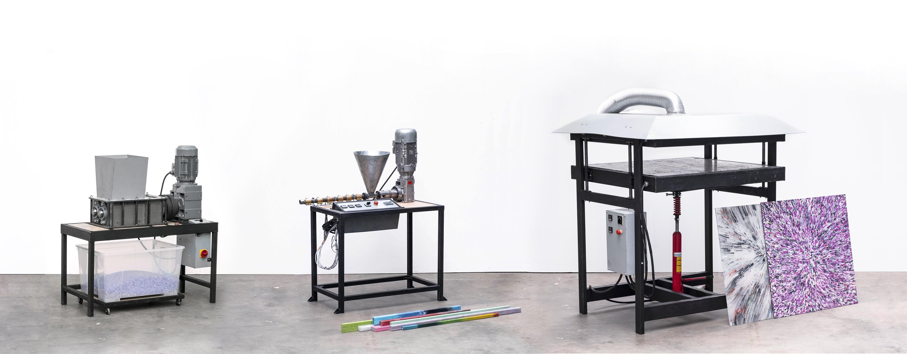

--- 
id: machine-inventory 
title: Machine Inventory 
sidebar_label: Research 
--- 
</img> 
# マシン在庫ガイド 
マシンインベントリはプレシャスプラスチックのマシンを記録し、共有するための場所です。これらのマシンはプレシャスプラスチックチーム、コミュニティ内のマシンショップ/ワークスペース、またはコミュニティのメンバー個人から提供されます。より多くの機械がコミュニティ内で共有され、Precious Plasticチームからより多くの機械の反復版が提供されるために作られました。 
### マシンインベントリ、ダウンロードキット、ハウツーの違い 
ダウンロード・キット（アカデミーと同じもの）は、"最終的な "コンテンツとデザインのためのものです。これは、私たちが何かを完全に完成させ、文書化し、人々にそれを再現することを奨励したいと思うときです。 
マシンの在庫は、より迅速な反復開発のためのものだ。最終的なデザインには多くの段階がある（正直に言うと、最終的なデザインは決して最終的なものではない）。マシン在庫はまさにそのためのものです。コミュニティから最新で最高のものを見つける場所ですが、必ずしもあなたの手をずっと握っているために必要なすべての文書が揃っているわけではありません。プレシャス・プラスチックのマシンを作ったことのあるマシンビルダーに最適です。 
ハウツーとは、プレシャス・プラスティック・ユニバースで何かをするための完全なステップバイステップのガイドです。それがマシンハックであれ、ユニークな収集システムであれ、新製品であれ、その他であれ。その範囲はマシンだけにとどまらず、提供する必要のある情報量という点では、より高度なものとなります。 
## ドキュメント 
完全で明確なドキュメントは、オープンソース・プロジェクトの開発にとって極めて重要です。また、ドキュメントの調和、つまりすべてのドキュメントで同じように見えるようにすることも重要だ。これにより、あるマシンから別のマシンへのジャンプがすぐに理解できるようになる。 
### マシンの命名 
プレシャス・プラスティック・ユニバースのマシンの命名には3つのパートがある： 
1.機械名 
2.大きな数字（大きな変化） 
3.スモールナンバー（小銭） 
マシンが初めてインベントリーに追加されたとき、それは1.0から始まる。もし "大きな変更 "があれば、2.0 に移動する。もし「小さな変更」、例えばボルトの変更や異なるホッパーのデザインの追加などがあれば、小さな数字だけが変更される(2.1)。 
✅ **例：シュレッダー・ベーシック 3.2** 
</img> 
機械名 👉 シュレッダー・ベーシック 
ビッグナンバー👉3（マシンの3回目のイテレーション） 
小数値 👉 .2（2回目の小反復） 
私たちはこれをマシンの*モデル*と呼んでいます（以前は*バージョン*と呼んでいました）。この変更は、プロジェクトのバージョン（Precious Plastic version 4）とマシンのモデル（Precious Plasticのバージョンに依存しない）の間の混乱を減らすために行いました。 
バザー](https://bazar.preciousplastic.com/)でマシンを販売する場合は、必ずマシンのモデルを明記してください。 
>注意：単純な変換（例：シュレッダー・ベーシック2.0USA変換）でない限り、プレシャス・プラスチックの公式リリースと同じ名前をつけないでください。その代わりに、あなた自身の名前を決めてください。 
### フォルダー構造： 
フォルダ構造は、インベントリに追加されたどのマシンでも同じで、このシステムに従うのが理想的です： 
	マシンの名称 📁 マシンの名称 
		1. 3D CAD 
			📁 STEPファイル 
			プログラムファイル（FreeCAD、Solidworks、Fusion 360、Rhino など） 
		📁 2.レーザーカットファイル (DXF 形式) 
		3. 2D ブループリント (PDF) 
		4. 回路図 
		📁 5. 部品表 (Libre Calc / Excel ファイル) 
		📁 6.その他 
			📁 オプション 
			📁 画像 
			ポスター 
			📁 テンプレート／治具 
			アップグレード 
			📁 ... 
## デザインの原則 
これらは、プレシャス・プラスティック・ユニバース全体のデザインを導く原則である。このリストはすべてを網羅しているわけではありませんが、マシンのデザインにおいてどのようなアイデアを念頭に置くべきかの一般的な考え方を示しています。 
* オープンソース 
* 入手しやすい（部品や材料は世界中で入手可能） 
* シンプル（過度に複雑な部分は避ける） 
* 複製可能（他の人のために構築プロセスを考えた） 
* 魅力的／親しみやすい 
* システマティック（このマシンの宇宙への適合性を念頭に置く） 
* 耐久性 
* 機知に富む 
* カスタマイズ可能 
* コラボレーション 
* モジュラー 
# フィルター 
### 品質評価 
レーティングは、図面がどの段階にあるのかを確認するために導入された。また、新しい図面には検証プロセスを経る必要がある。 
| Quality Rating |  Description           | 
|---------|------------| 
|  |   **Unknown**   The drawings of this machine are not according to any quality standard.         | 
|  |  **Good Documentation**    The drawings are uploaded according to our guidelines (above)          | 
|  |  **Reviewed Drawing**    Same as above + the drawings are also positively reviewed by Precious Plastic.        | 
|  |  **Tested machine**   Same as above + we tested the machine in real life and it works well.    | 
|  |  **Well Tested > 1 Year**    + We and community members used the machines for a long period of time and it works well.    | 
### 難易度 
難易度レベルとは、マシンを作るために必要な工具の複雑さを示すものです。これによって、どの程度複雑な機械が必要なのかを前もって理解することができます。難易度は5段階に分かれている。 
| Difficulty level |        Description     | 
|---------|------------| 
|  | **Level 1**    Only grinder / drill / welding 
|  | **Level 2**   Same as above + lasercut / heating element cabling 
|  | **Level 3**   Same as above + lathe work / motor cabling 
|  | **Level 4**   Same as above + milling / multiple axis lathe work / VFD 
|  | **Level 5**   Same as above + steel milling / pneumatic system or hydraulic system and some other complex stuff. Get yourself ready. 
## マシンをインベントリーに追加 
あなたのマシンを在庫に加えたいですか？いいね！世界中にあなたのマシンが複製されるのを見るのは、次のレベルの満足感です :) 
## 投稿ガイドライン 
* 上記の命名システムに従わなければならない 
* 少なくとも文書化された3D CADモデルを持っていること。 
* 文書が保存されている場所への公開リンクを提供しなければならない。 
## 自分の作品をどこで発表すべきか？ 
ファイルの保存場所は問いません。あなたにとって最適な方法をお選びください。いくつかのオプションをご紹介します： 
* グーグルドライブ 
* [GitHub](https://github.com/) 
* [GitLab](https://gitlab.com/) 
* [ウィキファクトリー](https://wikifactory.com/) 
* [Grabcad](https://grabcad.com/) 
## 自分のマシンをインベントリーに登録するには？ 
あなたのマシンをインベントリーに提出するための[フォーム](https://docs.google.com/forms/d/e/1FAIpQLSfTEshXP9IZuq5aoTi3z5l6bNfkBL1kLuVDxpDHQDXIYHehfQ/viewform?usp=sf_link)を作成しました。提出された情報を拝見し、ガイドラインに適合するかどうかを判断します。該当する場合は、マシンのサムネイルとインベントリへのリンクを追加します。 
