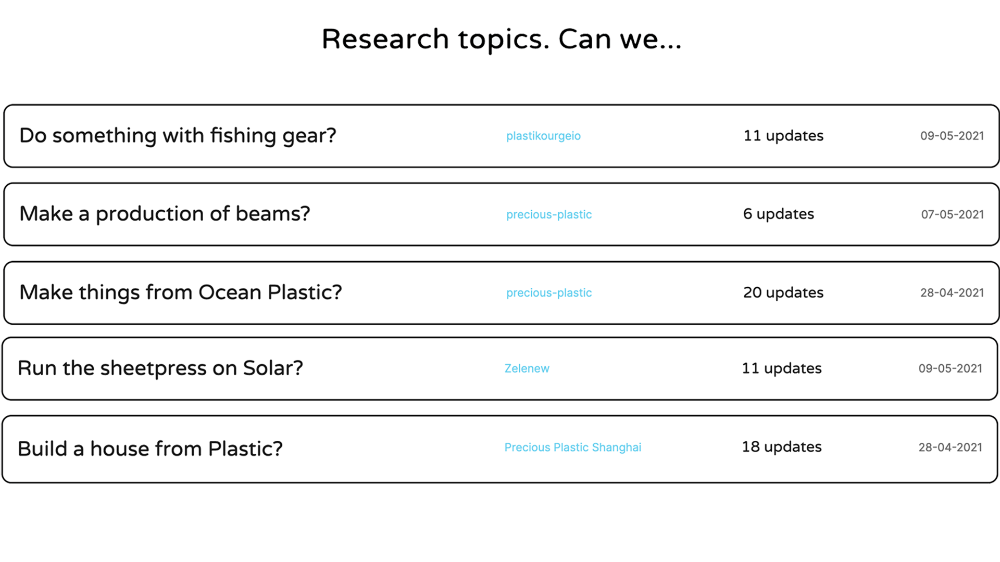

--- 
id: research 
title: Research module Guide 
sidebar_label: Research 
--- 
</img> 
# 研究モジュールとは何ですか？ 
コミュニティ・プラットフォームのこのモジュールは、人々が自分の研究を共有するために作られている。再生プラスチックの仕事には、まだまだ学ぶべきこと、解明すべきことがたくさんあります。誰もが自分の作業スペースで同じ失敗をするのではなく、お互いに学び合うことができるのです。それは、AからZまでのプロセスであり、その間にすべての間違い、失敗、ピボットがある。それは厄介で、荒っぽく、アウトプットが不確かなものだ。私たちの[ハウツー](https://community.preciousplastic.com/how-to)との違いは、ハウツーでは最終的な結果、実際にうまくいったことが掲載されることです。I'sは、何かをする「方法」を示すものであり、研究は「私たちは......」という質問から始まる。 
# 例 
私たちはこの機能をリリースしたばかりなので、まだ多くの例はありません。しかし、私たちは昔のフォーラムから多くのインスピレーションを得ました。これが、私たちが最も大切にしていた部分です。一緒に何かを考える。以下は、参考になる良い内容のトピックの例です。 
私たちは... 
[プラスチックを洗う](https://davehakkens.nl/community/forums/topic/washing-plastic-v4/) 
[プラスチックフィルムのソリューションを探す](https://davehakkens.nl/community/forums/topic/find-a-solution-for-foil-waste-v4/) 
[ロボットによるプラスチックの選別](https://davehakkens.nl/community/forums/topic/sorting-plastic-with-robotics-v4/) 
[プラスチックの未来を探せ](https://davehakkens.nl/community/forums/topic/experiment-with-future-plastic-alternatives-v4/) 
[一本の斧でシュレッダーを作る](https://davehakkens.nl/community/forums/topic/v4-shredder-development/) 
[チューブおよびプロファイルの押し出し](https://davehakkens.nl/community/forums/topic/v4-extrusion-tubes-and-profiles/) 
> このモジュールは現在まだベータ版です。もし面白い研究があればDiscordで教えてください。 
# その仕組み 
### 1: 📝調査を作成する： 
研究テーマは質問から始まる：「海洋プラスチックで何かできないか、太陽電池で押出機を動かせないか、フェイスマスクをリサイクルできないか。本当に必要なのは、質問と、それを解決するという決意だけだ。[研究ページ](https://community.preciousplastic.com/research)にアクセスし、研究を開始する。 
### 2: 📷アップデートを時系列で共有する 
ここからがエキサイティングなところだ。答えを見つけようとして、その都度最新情報を投稿する。これはすべて、そのトピックに飛び込みたい後輩にとって非常に有益なことだ。一般的には、実生活でのテストが最も興味深いが、文献や見たビデオなどを共有することもできる。トピックについて学んだばかりの最初の投稿は特に。 
- 画像は横長がベスト 
- 品質が完璧である必要はない。 
- 現在のところ、動画の埋め込みはYoutubeのみサポートしています。 
### 3: 🐛 我々は目を光らせている（β） 
私たちが述べたように、このモジュールはまだベータ版です。私たちはそれを注視し、[Discordの#feedbackチャンネル](https://discordapp.com/invite/n5d8Vrr)でフィードバックを共有してください。 
### 4: 💫 次のステップ。 
モジュールの準備が整い次第、公開します。つまり、あなたの研究は他の人たちの手本として使われることになるのです。つまり、あなたが基準を設定することになるのです :)その間、私たちは改善を続け、コメント、便利な機能、共同作業などのようなものは、後に予定しています。 
# ステップバイステップガイド 
| Step | Description| 
|-----------|---------| 
|| 1: Go the the [Research page](https://community.preciousplastic.com/research) page and click a research| 
|  | 2: Explain your research question. No images or video yet. Just some text to get started. | 
| ![step3] | 3: Add an update to your question.  | 
|  | 4: Posting your updates with images. Says more then 1000 words.     | 
|  | 5: Continue your research and build a nice journal for others.   | 
より多くのガイダンスが必要なら。ここに、一つの研究を示す[荒いビデオ](https://drive.google.com/file/d/1roEAdwNSK9HyE_1Jqm29d_cOusyYYHzU/view)がある。 
このモジュールを他の人のために機能させるパイオニアであることに感謝する！ 
