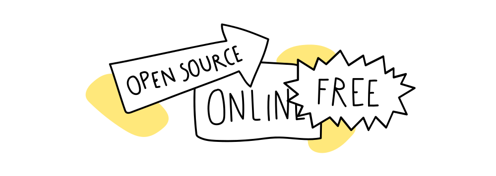
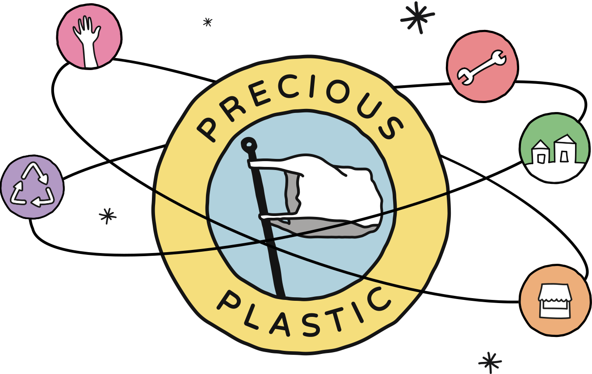

--- 
id: intro 
title: Intro 
sidebar_label: Hello! 🤙 
--- 

（ビデオコンテナ）
</iframe> 

 
 
# プレシャス・プラスチック・アカデミーへようこそ！ 

（ビデオ・チャプターズ 

（ビデオ・チャプターズ・メイン）
 
### あなたがプラスチックのリサイクルに関心を持っているのを見るのは素晴らしいことです。 
私たちはこのビデオ、チュートリアル、コンテンツのコレクションを作成し、プラスチック廃棄物を価値ある製品に変えることについて、過去7年間で学んだ最も重要なことを共有しています。 
私たちは、プラスチックの種類や見分け方、プラスチックの収集と分別、自分で機械を作る方法、採用できるビジネスモデル、プレシャス・プラスチックのコミュニティで重要なメンバーになる方法など、プラスチックの基本についてお教えします。 
ダウンロードキットとテンプレートをご用意しましたので、すべてご覧いただければ、世界中どこでもご自分のリサイクル・ワークスペースを始めることができます！ 

 

（ビデオチャプターサイドバー 
### ビデオ・チャプター 
- 00:00 はじめに 
- 00:42 何を学ぶのか 
- 01:40 ヘルプ＆フィードバック 
- 02:01 寄付する 
- 02:30 プロジェクトを広める 

 

 
 
## なぜこんなことを？ 
プレシャス・プラスティックは、プラスチック廃棄物の驚くべき可能性を世界に示すことで、プラスチック汚染をなくし、新たなバージン・プラスチックの需要を減らし、材料ループを閉じると同時に、世界中の人々により良い生活を提供したいと考えています。プレシャス・プラスティックは、何よりも、プラスチックに対する社会の見方を変えるための文化的なツールなのです。 
身の回りにあるプラスチックはすべて資源であり、廃棄物ではない。世界中に転がっている大きな可能性を秘めた素材であり、正しく処理すれば、新しい価値あるものに生まれ変わる。この資源は、私たちの環境に悪影響を与えないようにしながら、収入源になったり、地域社会の教育ツールになったりします。 
</img>
私たちは、機械、金型、消費者製品のオープンソースデザイン、リサイクルワークスペースを立ち上げ、運営するためのビジネスモデルやツールを提供することで、プラスチックリサイクル技術、インフラ、知識の分散化と地域化を図りながら、地球上の人々が地元でプラスチック廃棄物の処理を始めることができるよう、機械、文書、ビデオチュートリアル、キャンペーン、プラットフォームを作成しました。 
## オープンソースとライセンス 
私たちは、誰もが使用し利益を得られるよう、すべてをオープンソースで共有しています。つまり、すべての知識、ノウハウ、プロセス、方法論、ツールはオンラインでいつでも無料で利用できるということです。このオープンソースの哲学がプレシャス・プラスチックの核心であり、チーム内の意思決定のほとんどを形成しています。私たちは、協力は競争よりも強く、プラスチック問題は集団でしか解決できないと信じています。 
このプロジェクトの異なる部分は、異なるライセンス条件の下にある 
- コンテンツ： **私たちのすべてのコンテンツは、クリエイティブ・コモンズ 表示 - 継承 4.0 の下でライセンスされています。その要約は[こちら](https://creativecommons.org/licenses/by-sa/4.0/)で読むことができますし、完全な[ライセンス](https://creativecommons.org/licenses/by-sa/4.0/legalcode)をチェックすることもできます。 
- コード:** アカデミーサイトのコードライセンスは[GPL-3.0 License](https://github.com/ONEARMY/academy/blob/master/LICENSE)です。 
## 支援と参加 
<a href="https://support.preciousplastic.com/">プレシャス・プラスチックを支援する</a>方法はたくさんあります。 

プレシャス・プラスチックのコミュニティとつながることに興味がありますか？もっと学びたいとか、自分の知識を共有したいとか。それならラッキーです！私たちは<a href="https://discordapp.com/invite/cGZ5hKP">Discord</a>を作成し、ここで行っているすべてのことについて話し合っています。サイドバーの質問セクションをチェックして、地域や世界の人々とチャットできる場所を確認してください。 
よし、飛び込もう！ 
