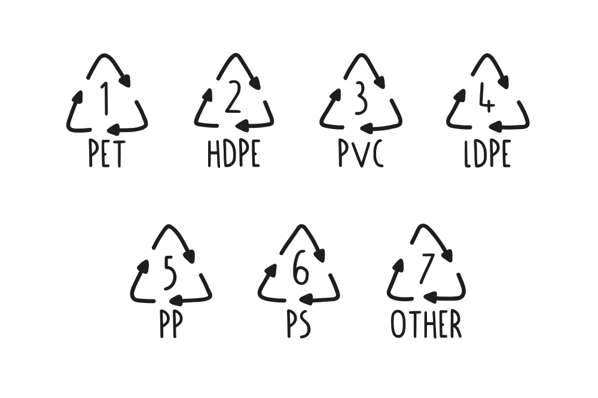

--- 
id: basics 
title: The Basics of Plastic 
sidebar_label: The Basics of Plastic 
--- 

（ビデオコンテナ）
</iframe> 

 
 
# プラスチックの基本 

（ビデオ・チャプターズ 

（ビデオ・チャプターズ・メイン）
 
### 最初から始めよう。 
プラスチックとは何か？プラスチックはどこから来て、私たちはどのくらい使い、何がリサイクルされているのでしょうか？プラスチックにはどのような種類があり、どのように見分けるのでしょうか？ここでは、プラスチックの基本について説明し、あなたがこれから扱う素材について素早く理解できるようにします！ 
> プロからのアドバイス：お手持ちのプラスチック製品の下を見て、それがどんな種類のプラスチックかわかるかどうか試してみてください。 

 

（ビデオチャプターサイドバー 
### ビデオ・チャプター 
- 0:11 イントロダクション 
- 00:18 プラスチックとは何か？ 
- 01:15 さまざまなタイプ 
- 02:45 プラスチックを認識する 
- 05:18 トランスフォーム・プラスチック 

 

 
# プラスチックとは何か？ 
プラスチックは私たちの身の回りのいたるところにある。 
 
プラスチックという言葉は日々私たちの口に入ってくるが、その本当の意味は何だろうか？この言葉自体は、ギリシャ語で「形づくることができる、成形することができる」を意味するプラスティコスに由来し、プラスチックがフィルム、繊維、プレート、チューブ、ボトルなど様々な形状にキャスト、プレス、押し出し成形されることを可能にする製造時の可鍛性を指している。 
プラスチックは主に石油から抽出される合成化学物質で、炭化水素（水素と炭素原子の鎖）からできている。ほとんどのプラスチックはポリマーで、モノマーと呼ばれる基本分子が何度も繰り返されてできた長い分子であり、この構造がプラスチックを特に丈夫で長持ちさせる。比較的安価で、製造が容易で、汎用性が高いため、プラスチックはシャンプーボトルから宇宙ロケットまで、膨大な種類の製品に使用され、拡大している。どこにでもあり、大量に生産されるプラスチックは、その強力な結合分子による分解速度の遅さ（最近の研究では500年）により、深刻な環境破壊を引き起こしている。つまり、あなたの両親や祖父母、曾祖父母の代から使われてきたプラスチックは、現在もなお存在し、さらに4世紀にわたって地球を汚染し続けるのだ。 
ほとんどのプラスチックには、性能を向上させたり製造コストを削減したりするために、添加剤と呼ばれる他の有機化合物や無機化合物が配合されている。添加剤の量は用途やプラスチックの種類によって大きく異なる。 
だから、世界中どこでも見つけることができるし、私たちが望まない場所にも行き着く。 
 
### 我々は毎年3億トンの新しいプラスチックを生産している。 
特に、すでにある材料で使えるものがたくさんあるときには。バージン・プラスチックは石油から作られている。石油は貴重な化石燃料であり、私たちが使い果たそうとしているものだ。これはあまりスマートではない。大きな設計ミスだ。そして、実際にリサイクルされるプラスチックは全体の10％にも満たないため、新しく生産されたプラスチックのほとんどは埋め立て地や海に捨てられるか、燃やされてしまう。え？ 
では、どうすればいいのか？それはリサイクルをすることだ！ 
> プロからのアドバイス：リサイクルと並んで、新しいプラスチックの使用を最小限に抑えるよう努力すべきである。 
# プラスチックの種類 
まず、プラスチックには大きく分けて熱可塑性プラスチックと熱硬化性プラスチックの2種類がある。 
 
### 熱硬化性 
熱硬化性プラスチックは、架橋して不可逆的な結合を作るポリマーを含んでいる。熱硬化性プラスチックはパンのようなもので、一度パンができると、熱を加えようとしても燃えてしまう。これらのプラスチックはいずれもリサイクルできない。熱硬化性プラスチックの例をいくつか挙げよう： 
 
### 熱可塑性プラスチック 
熱可塑性プラスチックは、熱すると柔らかくなり、冷えると硬くなるプラスチックポリマーである。熱可塑性プラスチックは何度も冷やしたり熱したりすることができる。熱すると溶けて液体になり、冷えると硬くなる。熱可塑性プラスチックはバターのようなもので、何度でも熱したり冷やしたりできる。熱可塑性プラスチックの例 
 
ありがたいことに、世界のプラスチックの80％は熱可塑性プラスチック（🎉）です。熱可塑性プラスチック（ここでは単にプラスチックと呼びます）は、その構造や特性によってさらに細かく分類され、通常、製品のどこかに印刷またはエンボス加工されているはずの名前や番号で見分けることができます。 
最も一般的なものは以下の通りだ： 
</img 
</img> 
### PET (1): ポリエチレンテレフタレート 
PETは非常に丈夫なプラスチックで、その透明な見た目からすぐに見分けがつく。水や炭酸飲料のペットボトルはすべてPETで作られているほか、一部の瓶、くし、バッグ、トートバッグ、カーペット、ロープなどもPETで作られており、より一般的にリサイクルされている。最近では、PETは糸にリサイクルされ、衣服に加工されている。  このプラスチックは加工が少し複雑なので、他のプラスチックから始めることをお勧めする。 
<b>特性:</b>軽量、耐衝撃性、剛性/半剛性  長所：</b> 強力で硬い、水と酸化物のバリア、良好な電気特性  短所</b>：高い成形収縮率、熱劣化、有害ガス 安全性：</b> 中程度  警告 ⚠️</b> 加工時に有害なガスが発生し、長期間の使用で有害物質が浸透することを示唆する調査結果もある 。 
<b>一般的な用途:</b> ブロー成形ボトル（水ボトル、ソーダ/ジュースボトル）、ラップ、フィルム、電気継手  
<b>PPマシンで使用するベストな方法：</b>私たちはそれに取り組んでいます！ 
</img>
### HDPE (2)：高密度ポリエチレン 
HDPEは、食品や飲料の容器のほか、牛乳瓶、モーターオイル、シャンプーボトル、石鹸瓶、洗剤、漂白剤、玩具、ボトルキャップなどによく使われる。この種のプラスチック製品は、分別回収や洗浄が容易であることが多い。HDPEは、プレシャス・プラスチックの機械と非常に相性がよく、まず最初に使うのに最適です！ 
<b>特性：</b>不活性、熱安定性、強靭性、高張力 。 
<b>長所：</b> 安価、高い耐薬品性、電気的特性、ワックス状の感触、良好な摩擦挙動 。 
<b>短所：</b> PPより硬度が低い、燃えやすい、耐紫外線性が低い、成形収縮率が高い  警告 ⚠️</b> HDPE自体は（燃えていない状態では）使用しても危険ではありませんが、添加物は危険な場合があります。 製品にどのような添加物が使用されているかを確認することはできません。 
<b>一般的な用途：</b>パイプ、玩具、ボウル、木枠、パッキングフィルム  
<b>PP成形機で使用するベストな方法：</b> HDPEはPPとよく似ていて、溶融温度が低く、成形しやすい。素晴らしい素材です！ 
</img> 
### PVC（3）：ポリ塩化ビニル 
PVCは有毒であり、私たちはPVCで作業することはできません。塩化ビニールは配管パイプによく見られ、熱を加えると塩化物を放出します！ 
<b>特性：</b> 絶縁性、化学的に不活性 。 
<b>長所：</b> 安価、耐酸性、耐アルカリ性、難燃性、硬くて強い  。 
<b>短所：</b>過熱による劣化、0℃以下では脆くなる、強い紫外線で変色する、熱可塑性プラスチックとしては密度が高い、燃やすとHCLやダイオキシンが発生する 。 
<b>安全性：</b> 安全ではありません。 
<b>警告⚠️</b> 危険な充填剤と、分解または燃焼時にHCLとダイオキシンを放出する。  
<b>Common uses:</b> Flexible: fake leather, seals, cable covers, tape. Rigid: pipes, building products, bottes, film, soles, heat-shrinking tubes 
  
<b>PPマシンでの最善の使用方法：使用しない！</b> 
</img> 
### LDPE (4)：低密度ポリエチレン 
LDPEは主にラップ、サンドイッチ袋、スクイーズボトル、プラスチック食料品袋に使用されている。  通常、LDPEはラベルが貼られていないことが多く、軽すぎて洗浄が難しい傾向があるため、一般的にはリサイクルされないが、プレシャス・プラスチックの技術を使えばむしろうまくいく。ビニール袋のリサイクル技術として人気があるのは、アイロンをかけてより丈夫な織物にすることだ。 
<b>特性：</b> 化学的に不活性、柔軟、絶縁  
<b>長所：</b>安価、耐薬品性および耐加水分解性、高い衝撃強度（低温）、良好な加工性 。 
<b>欠点：</b> 引張強度が低い、剛性が低い、最高温度が低い、焼けやすい、耐紫外線性が低い、成形収縮率が高い  警告 ⚠️</b> LDPE自体は（燃えていない状態では）使用しても危険ではありませんが、添加物は危険な場合があります。 製品にどのような添加物が使用されているかを確認することはできません。 
<b>一般的な用途:</b> ボウル、蓋、玩具、容器、フィム、スクイズボトル、パイプ、バッグ、シート 
  
<b>PPマシンでの最適な使用方法:</b> LDPEは箔であることが多く、シュレッダーにかけるには理想的ではありません。しかし、[鉄](https://www.youtube.com/watch?v=Pp4vmfVlm2k)と一緒に融合させたり、[大理石](https://www.youtube.com/watch?v=LV6Zp9i0mOc)を作るのに使うのは良い。 
</img> 
### PP (5): ポリプロピレン 
PPは、市場で最も一般的に利用されているプラスチックのひとつで、強度が高く、通常は高温に耐えることができます。PPの用途は多岐にわたりますが、タッパー、ヨーグルトの箱、シロップのボトルなど、食べ物や飲み物と接触する製品によく使われています。PPはプレシャス・プラスチックと非常に相性が良い。 
<b>プロパティ：</b>いくつかのプロパティはこちら  
<b>長所：</b> PEに似ているが、より強く、詰め物が多く、高温で密度が低いため、機械的、熱的、電気的性能が高く、低コストのエンジニアリング・プラスチック 。 
<b>短所：</b> PEより高コスト、0℃以下では脆い、ガス透過性が高い、燃料への耐性が低い、耐紫外線性が低い、燃え続ける  警告 ⚠️</b>PP自体は（燃えていない状態では）使用しても危険ではありませんが、添加物は危険な場合があります。製品にどのような添加物が使用されているか見ることはできません。 
  
<b>一般的用途：</b> 構造部品、パイプ、玩具、椅子、台所用品、DVDケース、包装、フィルム、織物、カーペット、ロープ、ネット 
  
<b>PPマシンでの最適な使用方法：</b>すべての機械で使用できます！私たちはポリプロピレンが大好きです！ 
</img>
### PS（6）：ポリスチレン 
PSは発泡スチロールとして最もよく知られているが、それ以外にも多くの製品に使われている。PSはリサイクル可能だが、効率は良くない。リサイクルには多くのエネルギーが必要なため、リサイクル可能な場所は少ない。使い捨てコーヒーカップ、プラスチック製食品箱、プラスチック製カトラリー、梱包用発泡スチロールはPSから作られている。プレシャス・プラスチックは、有毒なプラスチックのひとつだが（そのため、特別な注意が必要だ！）、同時にガラスに匹敵し、磨くことができるため、優れた審美性と触感を提供する。 
特性: 透明, 光沢, 固い, 硬い 
<b>特性：</b> 透明、光沢、硬い、堅い  。 
<b>長所：</b> 安価、成形収縮率が低い、断熱性が高い、低温に強い 。 
<b>短所</b>  脆い、耐摩耗性に劣る、耐薬品性に劣る 。 
<b>安全性：</b> 中程度  警告 ⚠️</b> PSを燃やすとスチレンが放出されることがある（有毒） 。 
<b>一般的な用途: </b> 玩具、CDケース、ライトディフューザー、電気ハウジング、カトラリー 
  
<b>PP加工機での最適な使用方法：</b>押出、シート、研磨（ガラス状素材） 
</img> 
### ミックス (7) 
このコードは、他の6種類のプラスチックでは定義されない他の種類のプラスチックを識別するために使用される。以下のようなプラスチックが含まれる。ABS、アクリル、ポリカーボネートなどはこのカテゴリーに含まれ、リサイクルが困難な場合があるが、プレシャス・プラスティックはこのカテゴリーに含まれる一部のプラスチックに対応することができる。 
<b>特性:</b>これには多くの異なる種類のプラスチックが含まれているため、特性は大きく異なる可能性があります。ですから、それがどの種類のプラスチックであるかによって異なります。識別できれば再利用できますが、混在している場合はカオスです。 
  
<b>長所：</b> この中には、作業するのに良いプラスチックがいくつかある。ABS、PLA、ナイロン。 
<b>短所：</b> 独自のラベルを持っていないことが多いので、識別が難しい。そのため、混ざり合ってカオスになっている 🌪️  
<b>安全性:</b> 溶ける温度を見つけるのが難しい。だから簡単に燃えてしまう。だから、それほど安全ではない。 
  
<b>警告：</b>ここに含まれるプラスチックの種類（PCなど）の中には、非常に有毒なガスを放出するものがあります。作業したいプラスチックの種類をよく知り、大量に処理する前にその特性をテストしてください。 一般的な用途：</b>PC（CDおよびDVDなど）、PLA（バイオプラスチック）、ABS（3Dプリント用フィラメント、玩具、電子製品など）、PMMA（アクリルガラス） 
  
## ♪ そしていつも忘れないで 
 
異なる種類のプラスチックを混ぜてはならない。品質が極端に低下し、リサイクルが非常に難しくなるからだ。さらに、異なる種類のプラスチックを一緒に溶かすと、油と水のように相分離し、層状に固まる傾向があるため、構造的に弱くなり、製品の品質が低下する。 
# 融解温度 
プラスチックにはさまざまな種類があり、それを分けることが重要な理由のひとつは、それぞれの溶ける温度にある。そのため、新しい高品質のアイテムを作るためには、それぞれのプラスチックが何度で溶けるのか、また、それぞれのプラスチックが何度で成形できるのかを知ることが重要なのです。しかしご安心ください！具体的な溶融温度については、<b>CREATE</b>のセクション（<i>デザイン</i>に進んでください）をご覧ください。しかし、プラスチックの種類を覚えておくことは重要なので、作業スペースやアトリエに便利なポスターを作りました。  
 
  
<b>フィードバックを共有したり、プラスチックについておしゃべりしたり、コミュニティからもっと学びたいですか？Discordの[#plastic](https://discordapp.com/invite/n5d8Vrr)チャンネルへどうぞ。ここでは、プラスチック、安全性、煙、材料特性について話しています</b>。 
プラスチックの基礎知識はここまで！次の章では、ジェリーがこれらのトピックをさらに深く掘り下げていきます。 
