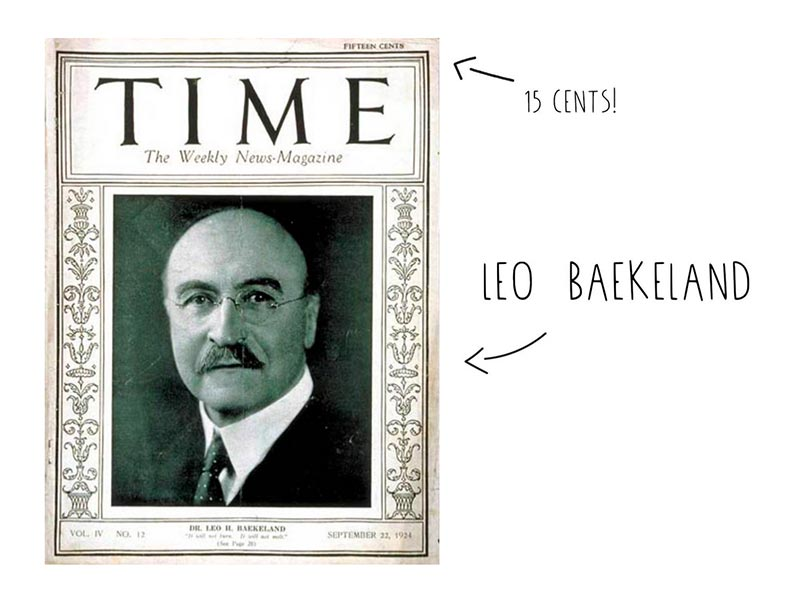

--- 
id: nerdy 
title: Go nerdy on Plastic 
sidebar_label: Nerdy on Plastic 
--- 

（ビデオコンテナ）
</iframe> 

 
 
# プラスチックでオタクになる 

（ビデオ・チャプターズ 

（ビデオ・チャプターズ・メイン）
 
### この豊富な素材について、少し深い知識を得よう。 
プラスチックはいつから私たちの社会に登場し、どのようにして小さなニッチ素材から世界の隅々まで行き渡るようになったのでしょうか？私たちはなぜ熱可塑性プラスチックだけを扱うのか。工業的な生産方法と、廃棄された後の処理についても説明する。これを読めば、あなたも（ジェリーのような）マニアックなプラスチック通になれるはずです。 
> プロヒント：地域のプラスチックのプロになることは、あなたやあなたの周りの人々がプラスチックについてより良い選択をするのに役立ちます。知識は力です！ 

 

（ビデオチャプターサイドバー 
### ビデオ・チャプター 
- プラスチックに関する一般知識 00.36 
- 工業生産方式 06.58 
- プラスチックのその後 14.56 

 

 
# プラスチックに関する一般知識 
プラスチックといえば、何を思い浮かべますか？買い物袋、ヨーグルトの容器、クレジットカード、ピンクのバケツでしょうか？では、これらのプラスチックと消しゴム、毛糸の帽子、椅子との関係は？これらはすべて、ポリマーという同じクラスの素材なのだ。ポリマーはモノマーからなる非常に長い繰り返し分子で、ポリ（poly）は多数、マー（mers）は部分、モノ（mono）は1つを意味する。つまり、ポリマーは1つの分子の多くの部分であり、長い反復鎖であると想像することができる。 
 
ウール、ゴム、毛髪、セルロース、でんぷんなど、昔から存在する天然ポリマーの材料もあれば、今日のさまざまな種類のプラスチックのような合成ポリマーの材料もある。プラスチックの場合、ポリマーは炭素に由来している。 
## ちょっとした歴史 
100％合成で作られた最初のポリマーは、ポリオキシベンジルメチルエングリコランヒドリドと呼ばれるものだった。これは1907年に化学者レオ・ベークランドによって作られ、一般にはベークライトと呼ばれていた。熱に強く、電気を通さないため、非常に優れた絶縁体であった。1924年、『タイム』誌はこれを「千の用途を持つ素材」と呼んだ。彼らは部分的に正しかった。 
</img> 
## ある科学 
ご存知のように、プラスチックは合成ポリマーからできている。ポリはマルチプル、マースはユニットを意味する。この図では、一群のモノマーが重合と呼ばれるプロセスでポリマーを作る。 
</img/> 
プラスチックに関しては、モノマーは化石燃料から作られ、分解と呼ばれるプロセスを経てプラスチックポリマーが作られる。製造方法の違いやポリマー構造の微調整によって、私たちは何百種類もの異なる性質や特性を持つプラスチックを手に入れることができる。この多様性は、化学者のアンドレア・セラによってよく説明されている： 
ポリエチレンテレフタレート（PET）は、2気圧の圧力に耐える強度を持つため、今日では発泡酒のボトルに使われている。しかし、冬用の柔らかい手袋も、花を包むプラスチックシートも同じ素材だ。鋳造方法が違うだけで、同じ素材なのだ。そして、これは1つのプラスチックに過ぎない！もうひとつの例として、一般的な牛乳瓶はポリエチレンでできている。炭素を1つだけ加えてポリプロピレンにすると、もっと頑丈な素材になる。 

注釈：プラスチックは、ピューター、紙、ガラス陶器で作られていた何百もの家庭用品や工業用品に取って代わった。プラスチックは永遠に長持ちするように見え、製造コストも安かったため、もてはやされた。しかし、その利点は、現在我々が知っているように、最大の欠点でもある。 
  
さて、科学の話に戻ろう。プラスチックの種類は全部で数百種類あり、前のセクションで説明したように、熱硬化性プラスチック、熱可塑性プラスチック、エラストマーという異なるカテゴリーに分類されます。私たちが扱うプラスチックは熱可塑性プラスチックで（熱を加えて形を変えることができるため）、多くの場合、1～6（PET、HDPE、PP、PS LDPE、PVC）のリサイクルロゴが付いています。 
簡単な総括だ： 
</img/> 
<b>熱硬化性</b>：これらのプラスチックは、互いに架橋して不可逆的な結合を作るポリマーを含んでいる。熱硬化性樹脂をパンに例えて考えてみよう。パンは一度作られると、熱を加えようとしても燃えてしまう。これらのプラスチックはどれもリサイクルできない。 
<b>熱可塑性</b>：熱すると柔らかくなり、冷えると硬くなるプラスチックポリマー。熱可塑性材料は何度も冷やしたり熱したりできる。熱すると溶けて液体になり、冷えると硬くなる。熱可塑性プラスチックはバターのようなもので、何度でも加熱・冷却が可能で、溶けてはまた固まる。 
<b>エラストマー</b>：熱硬化性樹脂と熱可塑性樹脂の中間で、天然ゴム、シリコーン、ネオプレン（ウエットスーツの素材）などがある。 
# 工業生産方式 
プラスチック製品の原料は通常、顆粒です。重合プロセスの後、プラスチックは小さなビーズやフレーク状になり、輸送効率が非常に高く、溶融も非常に簡単になります。プラスチックのリサイクルも同じようなプロセスで行われます。 
勿論、その種類は様々である。 
### 押出 
最も単純な製造方法は<b>押出</b>である。プラスチックは供給部に入り、そこで特殊なスクリューを通してダイまで押し出される。スクリューの形状は最初から最後まで直径が変わり、多くの熱と圧力にさらされ、スクリューの先端に達すると完全に溶けたプラスチックになります。そこから金型に入り、製品ごとに異なる形状の金型を使用することができます。 
</img> 
### ブロー成形 
また、[ブロー成形](https://www.youtube.com/watch?v=QpVNyCZ3gjw)のようなテクニックを使うこともできる。これは、まだ温かいうちに押出機の出力を取り出し、圧縮空気と金型の助けを借りてブロー成形する方法である。 
</img>
### 射出成形 
2つ目の少し複雑な方法は、[射出成形](https://www.youtube.com/watch?v=KYqpR50ES5o)である。この工程では、プラスチックを金型に注入し、固めてから冷やします。冷やされると、金型の形を保ちます。射出成形では、例えばレゴのピース、歯ブラシ、CDケース、カトラリーなど、多くの製品を作ることができる。金型についてもっと知りたいですか？(リンク） 
</img>
### 熱成形 
もうひとつの工業生産プロセスは、[熱成形](https://www.youtube.com/watch?v=hZzTg2M64-g)である。シートは柔軟な温度まで加熱され、特定の形状に成形された後、冷却され、トリミングされる。この工程は、使い捨てのカップ、容器、蓋、トレイなど、食品、医療、一般小売業界で使用される多くの薄肉プラスチック製品の製造によく使用される。 
</img>
### 回転成形 
この製法は、少量の大型プラスチック製品を作るのに使われる。プラスチックペレットを金型に入れ、均一に加熱しながら熱で溶かす。金型が高圧に耐える必要がないため、このプロセスは非常に柔軟である。しかし、非常に手間がかかり、かなりの時間がかかる。 
</img>
### 積層造形（または3Dプリンティング） 
これは比較的新しい製造方法だ。ここでは、複数の2Dレイヤーが3D形状を構成し、金型が不要なため好きなだけデザインを変更できるという利点がある。しかし、このプロセスには時間がかかり、現在、家庭ごみから3Dプリント用フィラメントを作るのはかなり難しい。 
</img> 
### 手動の方法 
最後に、もっと手作業でプラスチックを加工することもできる。ドリルで穴を開けたり、フライスで削ったり、旋盤で回したり、やすりをかけたり。より工芸品のように感じられ、美しい仕上がりになります。これらの技術についてもっと知りたいですか？ハウツーをご覧ください！ 
</img>
# プラスチックのその後 
つまり、市場に出回っているプラスチックのほとんどは、識別、分別、破砕され、新しい製品に生まれ変わることが可能であり、理想を言えば、これは地域的にも世界的にも有効であることを学んだ。しかし、残念ながらそうではない。プラスチック包装の約2％がクローズド・ループ・プロセスでリサイクルされ（つまり、包装の2％だけが新しい包装を作るためにリサイクルされる）、さらに8％がダウンサイクルされる。 
プラスチックのリサイクルが難しいのは、私たちの製品が他の材料と混ざっていることが多く、複数のプラスチックが融合しているため分解が困難であったり、プラスチックに多くの添加物が加えられているためである。 
 
プラスチックのリサイクルが難しいのは、私たちの製品が他の材料と混ざっていることが多く、複数のプラスチックが融合しているため分解が困難であったり、プラスチックに多くの添加物が加えられているためである。 
### では、もしあなたがプラスチックを持っていて、番号がないとしたら？ 
プラスチックの見分け方はいくつかある： 
<b>密度テスト</b> - この技術は、プラスチックの種類の異なる密度を利用します。プラスチックの種類によって、液体中で浮く密度が異なります。液体は塩水、アルコール、植物油、グリセリンなどがあり、この技術は業界で集中的に使用されている。ただし、2種類のプラスチックしか分離できないため、混合バッチを作る場合は何度も繰り返す必要がある。また、特にプラスチックに混合されている添加物のために密度が変化し、不正確になる可能性があるため、非常に厄介である。 
<b>赤外線検査</b> - このプロセスは非常に効率的で、赤外線を（通常はベルトコンベア上で）さまざまなプラスチックに照射することで機能する。それぞれのプラスチックは異なる分子構造を持っているため、反応を簡単に識別することができます。残念ながら、現在の技術では、プラスチックに含まれる濃い色の色素が信号を混ぜる可能性があるため、プラスチックの見間違いがしばしばある。  これについては、アカデミーの研究セクションの "ロボット選別 "で詳しく説明している。 
</img>
<b>燃焼試験</b> - これは、プラスチックの小片を切って火をつけるという簡単な手法です（ただし、有毒ガスが発生するので、定期的に行うことはお勧めしません！）。未知のプラスチックの切れ端を切って火をつけ、炎の色、性質、匂いを観察します。 
<b>手作業による選別</b> - これは手作業で、プラスチックがベルトコンベアに乗ってやってきて、人が共通のプラスチックを識別したり、SPIコードを使ったりする。このプロセスの問題点は、見た目や感触は同じでも素材が異なるものがあることだ。[2013年にオランダのデイヴが訪問している。](https://www.youtube.com/watch?v=Ktkn8TeoTA8) 
## 覚えておくといいことがある： 
- 化学薬品はHDPEボトルで保管されることが多い。 
- PPは非常に柔軟で、例えばヒンジに使用することができ、壊れることなく何度も曲げることができる。 
- PPをハンマーで叩くと粉々になる。 
- PEを潰しても、曲がるか変形するだけだ。 
- 熱可塑性樹脂と熱硬化性樹脂を簡単に見分けるには、鋭利な刃物で切断すると、熱可塑性樹脂は滑らかになり、熱硬化性樹脂は小さな粒子になる。 
<b>フィードバックを共有したり、プラスチックについておしゃべりしたり、コミュニティからもっと学びたいですか？Discordの[#plastic](https://discordapp.com/invite/n5d8Vrr)チャンネルへどうぞ。ここでは、プラスチック、安全性、煙、材料特性について話しています</b>。 
