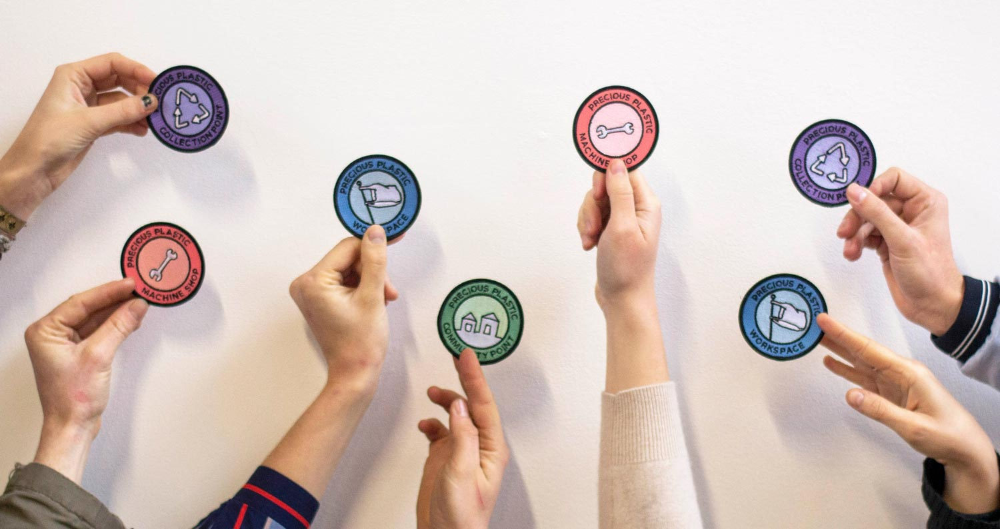

--- 
id: spaces 
title: Spaces 
sidebar_label: Intro 
--- 
 
 
# 貴重なプラスチック空間 
プレシャス・プラスチックスペースは、プレシャス・プラスチックの宇宙の構成要素です。各スペースは、リサイクルプロセスの1つの要素を担当します。一度に一つの側面に集中し、習得する。さまざまなスペースが相互に関連し、依存し合い、協力し合い、知識、プラスチック、専門知識を共有し、地域のプラスチック廃棄物問題に取り組んでいる。   
私たちは、シンプルさ、生産性、そして生活の質を念頭に置いて、それぞれのPrecious Plastic Spaceを設計、製造、テストしました。以下のセクションでは、フロアプラン、CADモデル、お勧めのツールなど、ステップバイステップのガイドをご覧いただけます。 
### 仕事をする上で、心に留めておくべき一般的なことがいくつかある： 
<b>1.チームメイトを見つける。あるいは2人。仕事を分担する相手がいれば、仕事はより楽しく、扱いやすくなる。例えば、エンジニア＋ビジネスウーマンといったように、あなたとチームメイトのスキルが補完し合えればベストだ。 
<b>2.カスタマイズ</b> あなたの置かれている状況（スペース、場所、製品）によって、プレシャス・プラスティック・スペースの設置方法は変わってきます。ここにあるプランは出発点として使い、よりあなたのニーズに合うようにアレンジする方法を常に探してください。 
<b>3.シンプルに保つ</b> 私たちは、スペースの最も基本的な要素（マシン、作業台、基本的なツール）から始め、マシンやテクニックを使い始めるにつれて、そこから作り上げていくことをお勧めします。そうすれば、自分のニーズに合ったものだけを作ったり買ったりすることができる。 
<b>4.歓迎</b> ワークスペースは単なるリサイクルセンターではなく、文化を変えるためのツールです。自分にとっても、チームにとっても、そして訪問者にとっても、素敵で楽しい場所になるよう、小さなことにも気を配りましょう。 
さあ、始める準備はできたかな？次の章では、プレシャス・プラスティック・スペースの設定方法について説明します。 
