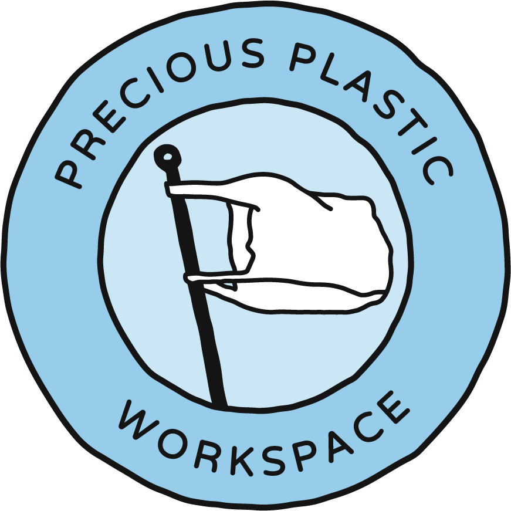

--- 
id: injection 
title: Setup an Injection Workspace 
sidebar_label: Injection 
--- 

。 
  <iframe width="800" height="400" src="https://www.youtube.com/embed/hIlmxuz1ZKs" frameborder="0" allow="accelerometer; autoplay; encrypted-media; gyroscope; picture-in-picture" allowfullscreen></iframe> 

 
 
# インジェクション・ワークスペース 

（ビデオ・チャプターズ 

（ビデオ・チャプターズ・メイン）
 
### このプレシャス・プラスティック・スペースは、プラスチック廃棄物を、携帯電話ケースやタイルのような型を使って、非常に精密な小品に加工する。 
あなたはインジェクション・ワークスペースをセットアップしたい。賢い選択です！インジェクション・ワークスペースの設置は3つのステップに分けられます。インジェクション・ワークスペースの立ち上げは、主に3つのステップに分けられます： 
1.<b>検索：</b>スペースを選ぶときに考えること 
2.<b>計画：</b> スペースを効果的に計画する方法 
3.<b>ビルド:</b> 何もない部屋をインジェクション・ワークスペースに変える。 
これらの各ステップについて、以下で詳しく説明する。 

 

（ビデオチャプターサイドバー 
### ビデオ・チャプター 
- 00:00 はじめに 
- 00:49 射出成形機 
- 01:01 プラスチックの調達と破砕 
- 01:38 シュレッダーの時間 
- 02:16 注入プロセス 
- 03:56 物流 

 

 
## ＃ ᔍ 検索 
ワークスペースを設ける最初のステップは、スペースを見つけることだ（当たり前だ）。スペース探しにはいくつかの注意点があります。 
1.<b>サイズ：</b> 機械や道具を自由に動き回れる十分なスペースを確保することが重要です。私たちが設計したインジェクション・ワークスペースは、およそ5 x 6メートルです。これより大きくすることもできますが、シュレッダーを含めると（私たちのように）、これより小さくすることはお勧めできません。 
2.<b>電気:</b> インジェクションマシンは単相で動作するが、シュレッダーは三相で動作することもあるので、スペースを選ぶ際には使用予定のモーターのスペックを必ず確認すること。 
3.<b>予算：</b>スペースが機能的なニーズを満たしていることを確認する一方で、予算に合うかどうかを念頭に置くことも重要です。 
> このような機会が地元にあるかどうか、アクセラレーターや自治体の担当者に問い合わせてみる価値がある。 
## ✍️ プラン 
あなたのスペースが見つかりました。あとは、あなただけの間取りに合わせて、ワークスペースの要素をどのように配置するか、計画を立て始めましょう。 
スペースはそれぞれ違うので、レイアウトをカスタマイズするチャンスです。 
ダウンロード・キットには、スターター・フロアプラン、CADモデル、カスタム・フロアプランナーが含まれています。 
 
有望と思われる間取りができたら、それを実際に空間の床にチョークで書き出して試してみる。納得のいく間取りができるまで、何度も繰り返してください。 
## ＃ 😎 ビルド 
間取りが決まったら、今度は何もない部屋をインジェクション・ワークスペースに変身させましょう。 
### 基本から始める 
射出成形機、作業台、基本的な工具など、最も必要なものから始め、そこから自分のワークフローに最も適したものを見つけ出していく。 
プレシャス・プラスティック・スペースを始めるにあたって、新しい材料や資源の使用量を減らすために、可能な限り中古品の選択肢を探しましょう。必要なものが中古で手に入らない場合は、新しく買うか、作る。そして常に、安さよりも質の良さを追求しましょう。 
必要不可欠なアイテム 
- 射出成形機 - もちろん。 
- 細断されたプラスチックの保存容器 - これは、あなたが誰からプラスチックを買うかによって決まるかもしれない。最も重要なのは、誤ってこぼれないように頑丈であること。透明なものが良いが、必須ではない。 
- レーザーカット、CNC、3Dプリント、アルミニウム、スチール、アクリル。<a href="https://community.preciousplastic.com/">ハウツー</a>をチェックして、インスピレーションを得てください。 
- 基本工具-スパナ、パテナイフ、安全眼鏡、ハンマー、ノミ、耐熱手袋、タイマー、スコップ。 
- 換気-フィルターマスク、換気キャディ、詳しくは<a href="https://community.preciousplastic.com/academy/plastic/safety">安全ビデオ</a>をご覧ください。 
- 作業台。 
- 切り落としコンテナ。 
基本的なワークスペースが設定できたら、インジェクターを使ってワークフローを開発し、より効率的で快適な作業のために何が役立つかを確認しましょう。 
そして、自分だけの魅力をスパイスとして加えることを恐れないでください。）観葉植物、ポスター、適切な照明、ラジカセなど、あなたのワークスペースは、あなた自身にとっても、立ち寄る人にとっても、より楽しいものになるでしょう。 
### 宇宙におけるあなたの役割 
| Your icon  |  Your task | 
|----------|----------------------| 
|         |  __Workspace__   A Precious Plastic Workspace is a place where plastic gets transformed from waste into valuable materials or products. There are five different workspaces: Shredder, Extrusion, Sheetpress, Injection and Mix. | 
## 👋シェア 
インジェクション・ワークスペースが完成しました。素晴らしい！私たちはみんな一緒に学んでいるので、あなたのスペースをより良くするために役立ったハックや開発をぜひシェアしてください。旅を楽しんでください。 
<b>フィードバックを共有したり、インジェクション・ワークスペースについておしゃべりしたり、コミュニティからもっと学びたいですか？Discord の [#Spaces](https://discordapp.com/invite/p92s237) チャンネルにアクセスしてください。ここでは、質問に答えたり、ワークスペースの設定や実行方法についてヒントを与えたりしています。 
