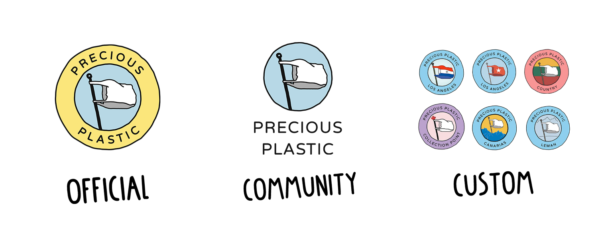
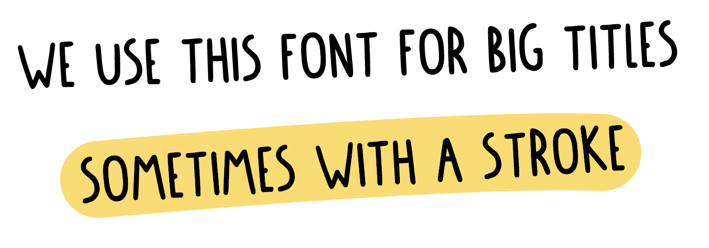
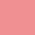
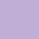
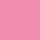
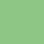

--- 
id: branding 
title: Branding 
sidebar_label: Style guides 
--- 
 
# プレシャス・プラスチックのスタイルとグラフィック 
プレシャス・プラスティックはグローバルなオープンソースコミュニティです。つまり、人々は好きなものを何でも手に入れ、作ることができるのです。ですから、個人、グループ、そして本部の私たちがポスター、ウェブサイト、ステッカーなどのグラフィック素材を作っています。しかし、私たちは世界規模で協力することを好んでいます。ランダムにたくさんのものを作るのではなく、まとまりのあるものを作りたいんだ。誰かが何かを作れば、地球の裏側にいる誰かがそれを使うことができる。そのために、私たちはいくつかのスタイルガイドを持っています。 
</img> 
# 私たちのさまざまなロゴ 
私たちが使用するロゴには、基本的に3つの種類があります。それぞれに機能があります。 
1.**公式ロゴ： **このロゴは本部でのみ使用されています。私たちが別のロゴを使用しているのは、私たちがプレシャス・プラスティック・スペースとして活動しているのではなく、コミュニティのために開発やインフラ運営を行っているからです。このロゴを使うことで、何が公式なものなのかがわかりやすくなります。*このロゴは使用しないでください。 
1.**コミュニティ・ロゴ： **これはコミュニティがコミュニティのために作ったものに使われます。例えば、ポスター、ステッカー、Tシャツ、コミュニティが運営するフォーラムなどです。世界中の他のメンバーも使えるもの。 
1.**これらのロゴは世界中の[Spaces](../spaces)で使用されています。コミュニティ・ポイント、ワークスペース、マシンショップ、コレクション・ポイント。このロゴは、あなた自身の名前を入れてカスタマイズすることができます。これらのロゴは、あなた自身のスペース、名刺、ワークスペースの外の看板、ソーシャルメディアのアカウントなどを宣伝するために使用されます。 
。 
# フォントを使用する 
私たちは主に3種類のフォントを使用しています。タイトル用、字幕用、テキスト用です。タイトルには、ダウンロードキットの中にある、私たちが作ったPrecious Plasticフォントを使用しています。大きくてかさばらないのがいいですね。字幕には、アカデミーにあるようなVarela Roundを使っています。私たちはこのフォントをもう少し太く、しばしば大文字で使うことを好みます。ポスターやロゴにも使われています！そして最後に、私たちのテキストはほとんどがデジタルです。これにはシステム・フォントを使います。  これらのフォントはすでにコンピュータにインストールされています。これにより、読み込みが簡単になり、帯域幅も節約できます。しかし、各デバイスでは少し違って見えます。 
のように。 
# プレシャス・プラスチック・カラー 
色は私たちにとって重要な鍵であり、大好きな色だ。親しみやすく、私たちにとってはシュレッダープラスチックを象徴している。しかし、私たちは整理整頓され、物事を明確にするためにも色を愛用しています。ランダムに使うのではなく、私たちのDNAとUXデザインに組み込まれているのです。私たちは数年前にアカデミーでこの色を使い始め、それを基に発展させてきました。これが私たちのメインカラーです； 
## アカデミーカラー 
| Color   |  Location & Hex code         | Color | Location & Hex code                  | 
|----------|---------------|--|--------| 
|  | __Intro__   #CDCFD5    |  | __Business__   #F6B67B	| 
|  | __Plastic__   #95D2EF |   | __Spaces__   #2DAE9E |   
|  | __Build__   #F19093 |     | __Research__   #798BC5 | 
|  | __Collect__   #C0ADD4 |   | __Universe__   #F18DAF | 
|  | __Create__   #FCDE8A |   | __Support & Download__   #CDCFD5 | 
## スペースカラー 
|  color | Location & Hex code           | color | Location & Hex code                   | 
|----------|---------------|--|--------| 
|  | __Community Points__   #8FC487    |  | __Workspaces__   #95D2EF	| 
|  | __Collection Points__   #C0ADD4    |  | __Machine shop__   #F19093	| 
# 貴重なプラスチックのグラフィックを作ろう 
グラフィックはメッセージを伝える強力なツールです。私たちは、溶融温度やプラスチックの種類など、乾燥した機能的な情報を共有するために使用しています。例えば、回収ポイントのキャンペーン・ポスターのように、私たちはグラフィックを使って人々を惹きつけ、プラスチックに目を向けるきっかけを作ります。また、ソーシャルメディアやウェブサイトなど、デジタルでも活用しています。そして、おそらく様々な目的や作るべきものがあり、私たちはすべての例を持っているわけでも、すべてのガイドラインを深く知っているわけでもありません。一番いいのは、私たちがすでに提供しているグラフィック素材を見て、それを例やテンプレートにして、それをもとに作ることです。そして、もしそれが良いものかどうかわからない場合は、Discordで共有してください。） 
のように。 
<b>質問がある、ポスター作りを手伝ってほしい、作ったものを共有したい？Discordの[#ユニバース](https://discordapp.com/invite/QUw8A3w)チャンネルへどうぞ。ここでは、あなたがユニバースでどのようにフィットするか、役割、ブランディング、あなた自身のロゴについて話します。 
